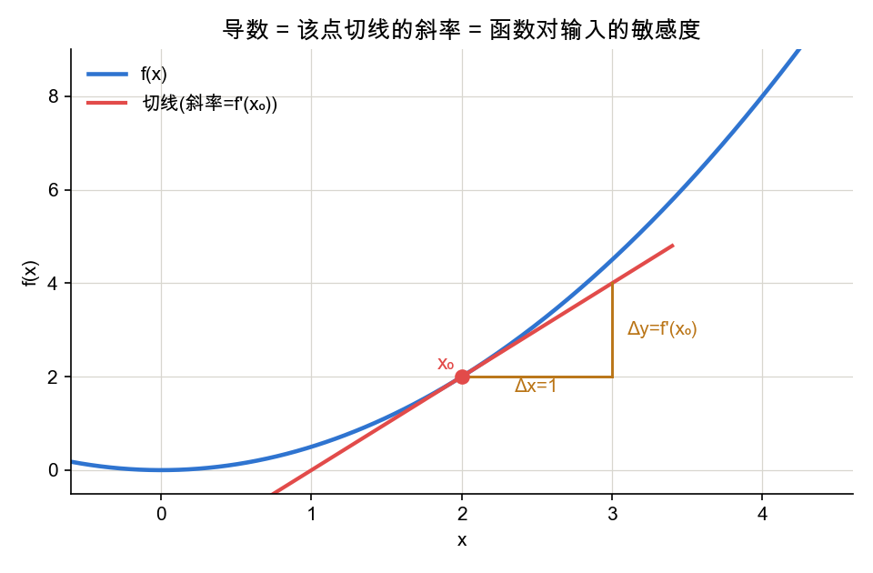
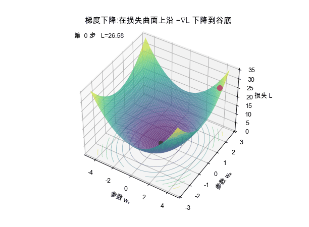
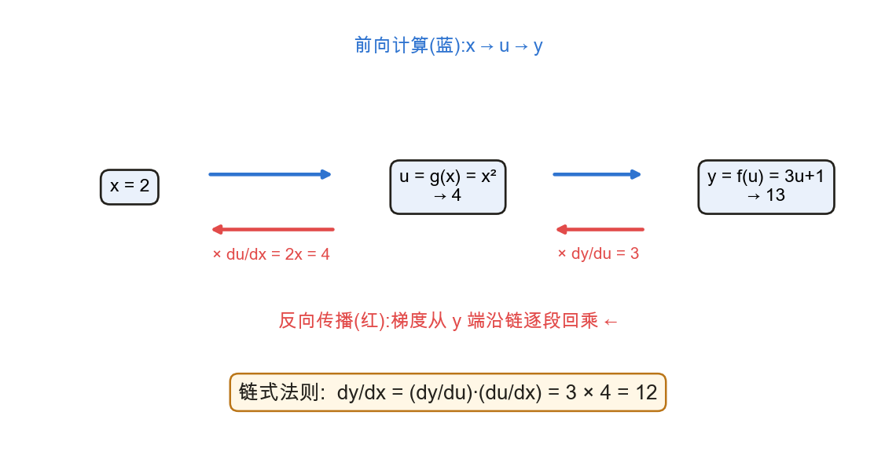

<!--# calc -->
# 微积分:导数与梯度

> 训练神经网络的本质,是用**梯度下降**最小化损失函数。理解这一过程所需的微积分核心有三:**导数(刻画敏感度)、梯度(多维方向)、链式法则(反向传播的数学内核)**。本节给出定义、公式与可视化,记号锚定 d2l 2.4。

## 1. 导数:函数对输入的瞬时变化率

📖 **权威详解**:[导数 · Wikipedia](https://zh.wikipedia.org/wiki/导数)

导数定义为差商的极限:
$$f'(x)=\lim_{h\to 0}\frac{f(x+h)-f(x)}{h}$$
其几何意义是函数曲线在该点**切线的斜率**,刻画"输入发生微小变化时,输出变化的快慢与方向"——符号给出方向,绝对值给出敏感程度。

常用求导法则:幂 $\frac{d}{dx}x^n=nx^{n-1}$、指数 $\frac{d}{dx}e^x=e^x$、对数 $\frac{d}{dx}\ln x=\frac1x$;以及乘法与除法法则
$$\frac{d}{dx}[fg]=f'g+fg',\qquad \frac{d}{dx}\Big[\frac fg\Big]=\frac{f'g-fg'}{g^2}$$
数值差商 $f'(x)\approx\dfrac{f(x+h)-f(x)}{h}$ 可用于直觉验证,但不用于实际训练(逐参数前向计算两次,代价过高)。

## 2. 偏导与梯度:多元函数的方向信息

📖 **权威详解**:[梯度 · Wikipedia](https://zh.wikipedia.org/wiki/梯度) ｜ [偏导数](https://zh.wikipedia.org/wiki/偏导数)

当函数依赖多个变量时,固定其余变量、仅对第 $i$ 个变量求导,得到**偏导数**:
$$\frac{\partial y}{\partial x_i}=\lim_{h\to 0}\frac{f(x_1,\dots,x_i+h,\dots,x_n)-f(x_1,\dots,x_i,\dots,x_n)}{h}$$
将全部偏导按分量排列,得到**梯度向量**:
$$\nabla_{\mathbf x}f(\mathbf x)=\Big[\frac{\partial f}{\partial x_1},\ \frac{\partial f}{\partial x_2},\ \dots,\ \frac{\partial f}{\partial x_n}\Big]^\top$$
梯度的关键性质:$\nabla f$ 指向函数**上升最快**的方向,其反方向 $-\nabla f$ 指向下降最快的方向。

这正是**梯度下降**的依据——沿负梯度方向、以步长 $\eta$(学习率)迭代更新参数,损失随之下降:
$$\mathbf x\leftarrow\mathbf x-\eta\,\nabla f(\mathbf x)$$

深度学习中反复出现的若干向量求导规则(线性回归、反向传播将直接使用,详见 [矩阵求导](node:matcalc) 节):
$$\nabla_{\mathbf x}(\mathbf A\mathbf x)=\mathbf A^\top,\qquad \nabla_{\mathbf x}(\mathbf x^\top\mathbf A\mathbf x)=(\mathbf A+\mathbf A^\top)\mathbf x,\qquad \nabla_{\mathbf x}\lVert\mathbf x\rVert^2=2\mathbf x$$

## 3. 链式法则:反向传播的数学内核

📖 **权威详解**:[链式法则 · Wikipedia](https://zh.wikipedia.org/wiki/链式法则)

复合函数的求导法则。单变量情形,若 $y=f(u),\ u=g(x)$:
$$\frac{dy}{dx}=\frac{dy}{du}\cdot\frac{du}{dx}$$
多变量情形($y$ 经由中间变量 $u_1,\dots,u_m$ 依赖各 $x_i$):
$$\frac{\partial y}{\partial x_i}=\sum_{j=1}^{m}\frac{\partial y}{\partial u_j}\,\frac{\partial u_j}{\partial x_i}$$
神经网络是多层复合函数。**前向**逐层算出各中间量的数值;**反向**则把"损失对深层参数的偏导"沿这条链**逐段回乘**——这构成了**反向传播(backpropagation)**算法的数学基础。

如上图,$y$ 对 $x$ 的导数 $=$ 后一段局部导数 $\frac{dy}{du}$ 乘前一段 $\frac{du}{dx}$。把每个节点的"局部导数"乘起来,就得到端到端的梯度——这就是反向传播在做的事。

## 应掌握的要点
- 导数的极限定义及其几何意义(切线斜率 / 敏感度);
- 梯度为偏导组成的向量、指向上升最快方向,梯度下降沿 $-\nabla f$ 迭代;
- 单变量与多变量链式法则,及其与反向传播的关系(前向算值、反向回乘)。

---
### 参考链接
- [d2l 2.4 微积分](https://zh.d2l.ai/chapter_preliminaries/calculus.html)(公式与记号锚定此页)、[d2l 2.5 自动微分](https://zh.d2l.ai/chapter_preliminaries/autograd.html)
- [3Blue1Brown《微积分的本质》](https://www.3blue1brown.com/topics/calculus) — 几何直觉
