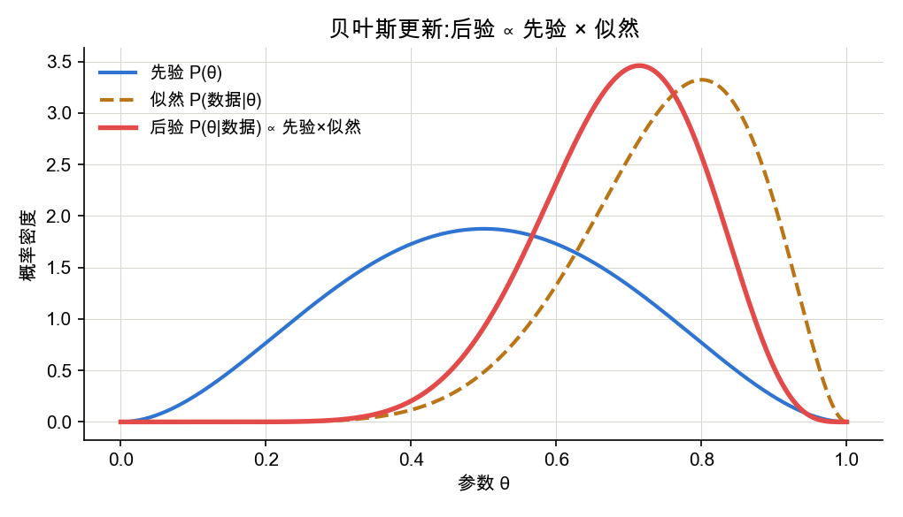
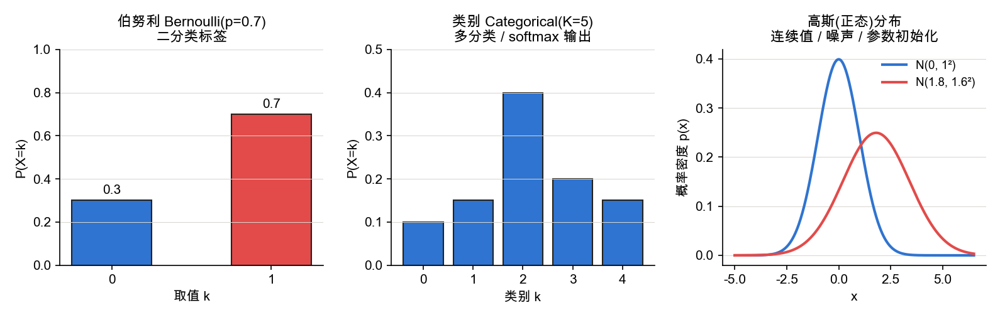
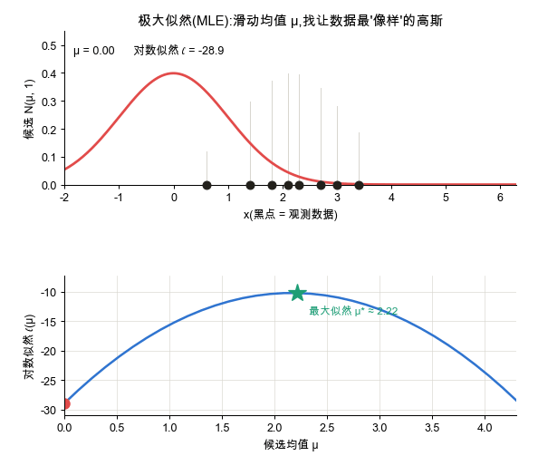
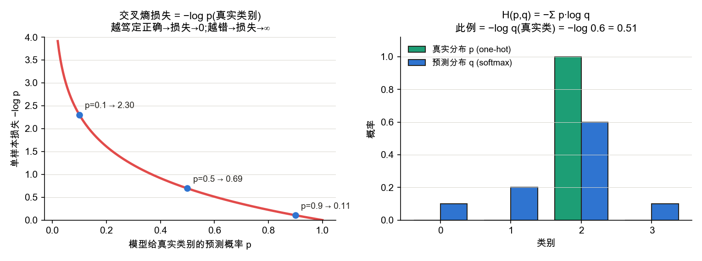

<!--# prob -->
# 概率基础

> 深度学习里,数据和标签都被看作**随机变量**,模型输出常常是一个**概率分布**。训练的目标——"让模型尽量解释观测到的数据"——用概率语言精确表述就是**极大似然估计(MLE)**;由它出发,能自然推导出回归用的 **MSE**、分类用的**交叉熵**。本节从分布讲到信息论,把"为什么是这个损失函数"说清楚。记号锚定 d2l 2.6。

## 1. 随机变量与概率分布

📖 **权威详解**:[概率分布 · Wikipedia](https://zh.wikipedia.org/wiki/概率分布)

**随机变量**把随机结果映射为数值。其取值规律由**分布**描述:离散用**概率质量函数 PMF** $P(X=k)$,连续用**概率密度函数 PDF** $p(x)$。两者都必须满足**非负**与**归一化**——离散情形 $\sum_k P(X=k)=1$,连续情形 $\int_{-\infty}^{\infty} p(x)\,dx=1$。注意连续情形下 $p(x)$ 是"密度"而非概率,可以大于 1,只有在区间上积分才得到概率。

## 2. 期望与方差:分布的中心与离散程度

📖 **权威详解**:[期望值 · Wikipedia](https://zh.wikipedia.org/wiki/期望值) ｜ [方差](https://zh.wikipedia.org/wiki/方差)

**期望**是分布的加权平均(中心):离散 $\mathbb E[X]=\sum_k k\,P(X=k)$,连续 $\mathbb E[X]=\int x\,p(x)\,dx$。**方差**刻画偏离中心的程度:
$$\operatorname{Var}(X)=\mathbb E\big[(X-\mathbb E[X])^2\big]=\mathbb E[X^2]-(\mathbb E[X])^2$$
期望的**线性性** $\mathbb E[aX+bY]=a\mathbb E[X]+b\mathbb E[Y]$(无需独立)在推导中极常用。深度学习里,小批量(mini-batch)上的平均损失,就是用样本均值**估计**真实期望损失。

## 3. 条件概率、独立与贝叶斯

📖 **权威详解**:[条件概率 · Wikipedia](https://zh.wikipedia.org/wiki/条件概率) ｜ [贝叶斯定理](https://zh.wikipedia.org/wiki/贝叶斯定理)

在已知事件 $B$ 发生的前提下 $A$ 的概率:
$$P(A\mid B)=\frac{P(A\cap B)}{P(B)}$$
若 $P(A\cap B)=P(A)P(B)$ 则称 $A,B$ **独立**。把条件概率两边展开即得**贝叶斯定理**——它给出"看到数据后如何更新对参数的信念":
$$P(\theta\mid \mathcal D)=\frac{P(\mathcal D\mid \theta)\,P(\theta)}{P(\mathcal D)}\ \ \propto\ \ P(\mathcal D\mid\theta)\,P(\theta)$$
其中 $P(\theta\mid\mathcal D)$ 是**后验**、$P(\mathcal D\mid\theta)$ 是**似然**、$P(\theta)$ 是**先验**、分母 $P(\mathcal D)$ 是归一化常数(证据)。

**先验**是看到数据前的信念,**似然**是数据对各参数取值的支持度,二者相乘(再归一化)得到**后验**。当先验取均匀分布时,最大化后验就退化为最大化似然(下一节)。贝叶斯视角也解释了正则化:**L2 正则 ≈ 给参数加一个高斯先验**。

## 4. 深度学习常用的三种分布

📖 **权威详解**:[伯努利分布](https://zh.wikipedia.org/wiki/伯努利分布) ｜ [范畴分布](https://zh.wikipedia.org/wiki/范畴分布) ｜ [正态分布](https://zh.wikipedia.org/wiki/正态分布)

- **伯努利分布** $\mathrm{Bernoulli}(p)$:单次二值事件,$P(X=1)=p$。对应**二分类**标签,模型用 sigmoid 输出 $p$。PMF:$P(X=k)=p^{k}(1-p)^{1-k},\ k\in\{0,1\}$。
- **类别分布** $\mathrm{Categorical}(\boldsymbol p)$:$K$ 选一,$P(X=k)=p_k,\ \sum_k p_k=1$。对应**多分类**标签,模型用 **softmax** 输出 $\boldsymbol p$。
- **高斯(正态)分布** $\mathcal N(\mu,\sigma^2)$:连续值的默认模型,也用于噪声假设与参数初始化。PDF:
$$p(x)=\frac{1}{\sqrt{2\pi}\,\sigma}\exp\!\Big(-\frac{(x-\mu)^2}{2\sigma^2}\Big)$$

## 5. 极大似然估计(MLE):把"训练"翻译成概率

📖 **权威详解**:[最大似然估计 · Wikipedia](https://zh.wikipedia.org/wiki/最大似然估计)

给定一组独立同分布的数据 $\{x_1,\dots,x_N\}$ 和带参数 $\theta$ 的模型,**似然**是模型生成这批数据的概率。MLE 选取让似然最大的参数;因连乘易下溢,实际最大化**对数似然**(等价,$\log$ 单调):
$$\theta^{*}=\arg\max_{\theta}\prod_{i=1}^{N} p(x_i;\theta)=\arg\max_{\theta}\sum_{i=1}^{N}\log p(x_i;\theta)$$
取负号,就得到训练里最小化的**负对数似然(NLL)**,即损失函数 $\mathcal L(\theta)=-\sum_i\log p(x_i;\theta)$。

如上图,固定 $\sigma$、滑动高斯均值 $\mu$:当曲线最贴合数据时,对数似然(下方)登顶——**最大似然估计就是"挑一个让数据最不意外的参数"**。

**两大损失都由此导出**:
- 假设输出服从**高斯**(回归),$-\log p\propto \dfrac{(x-\mu)^2}{2\sigma^2}$,最小化 NLL $\Longleftrightarrow$ 最小化**均方误差 MSE**;
- 假设输出服从**类别分布**(分类),NLL $=-\log q_{y}$($q_y$ 为模型给真实类别的概率),正是**交叉熵损失**(下一节)。

## 6. 信息论:熵、交叉熵与 KL 散度

📖 **权威详解**:[熵(信息论) · Wikipedia](https://zh.wikipedia.org/wiki/熵_%28信息论%29) ｜ [交叉熵](https://zh.wikipedia.org/wiki/交叉熵) ｜ [相对熵(KL 散度)](https://zh.wikipedia.org/wiki/相对熵)

一个概率为 $p$ 的事件,其**自信息**(意外程度)为 $-\log p$:越罕见越"意外"。对整个分布取期望,得到**熵**——分布固有的平均不确定性:
$$H(p)=-\sum_x p(x)\log p(x)$$
用分布 $q$ 去编码真实分布 $p$ 的平均代价,是**交叉熵**;二者之差是 **KL 散度**(衡量 $q$ 偏离 $p$ 多少,恒非负,$p=q$ 时为 0):
$$H(p,q)=-\sum_x p(x)\log q(x),\qquad D_{\mathrm{KL}}(p\,\|\,q)=\sum_x p(x)\log\frac{p(x)}{q(x)}=H(p,q)-H(p)$$

分类任务里,真实分布 $p$ 是 one-hot,故 $H(p,q)=-\log q_{y}$——**交叉熵损失 = 给真实类别的预测概率取负对数**:预测越笃定且正确,损失越接近 0;越自信地错,损失越趋于无穷(左图)。由于 $H(p)$ 是常数,**最小化交叉熵 $\Longleftrightarrow$ 最小化 $D_{\mathrm{KL}}(p\,\|\,q)$ $\Longleftrightarrow$ 第 5 节的极大似然**——三种说法,同一件事。

## 应掌握的要点
- 分布的两条铁律:非负 + 归一化;期望是中心、方差是离散度;
- 贝叶斯:后验 ∝ 似然 × 先验;均匀先验下最大化后验 = 极大似然;
- 三种分布对应三类输出:伯努利↔二分类、类别↔多分类(softmax)、高斯↔回归;
- **MLE 是主线**:负对数似然就是损失;高斯假设导出 MSE,类别假设导出交叉熵;
- 交叉熵 = $-\log$(真实类预测概率);最小化交叉熵 = 最小化 KL = 极大似然。

---
### 参考链接
- [d2l 2.6 概率](https://zh.d2l.ai/chapter_preliminaries/probability.html)、[d2l 3.4 softmax 回归(交叉熵)](https://zh.d2l.ai/chapter_linear-networks/softmax-regression.html)
- [李沐《动手学深度学习》视频课](https://www.bilibili.com/video/BV1if4y147hS) — 中文直觉讲解
