<!--# linalg -->
# 线性代数

> 线性代数最该被纠正的认知是:**别把矩阵当成一张数字表格,把它当成一个"动作"——对整个空间的一条线性变换指令**。而这条指令**完全由基向量(î、ĵ)被搬到哪里决定**:矩阵的列,就是基向量变换后的落点。接受这个视角后,行列式、逆、特征值都不再是孤立公式,而是同一件事的不同侧面。神经网络每一层 $Wx$ 是一次空间变换,注意力的 $QK^\top$ 是点积,PCA/SVD 是特征向量——都建立在此之上。配图为本节自绘(matplotlib),公式锚定 d2l 2.3。

判定"线性"的精确标准是同时满足**可加性** $f(\mathbf u+\mathbf v)=f(\mathbf u)+f(\mathbf v)$ 与**齐次性** $f(k\mathbf u)=k\,f(\mathbf u)$。其可视化表现是:变换后网格线在各自方向上仍**平行、等间距,且原点不动**(两族网格的间距可不同、也不必正交)。正因这两条性质,任意向量写成基向量的线性组合后**组合系数不变**——只要知道 î、ĵ 的落点,就能推出任意向量的落点。

## 1. 矩阵 = 线性变换:列 = 基向量落点

📖 **权威详解**:[线性映射 · Wikipedia](https://zh.wikipedia.org/wiki/线性映射)

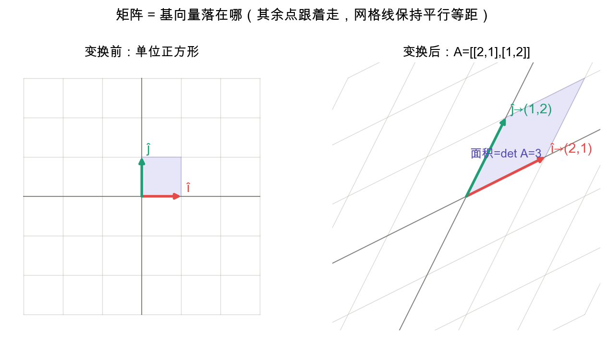

向量 $\mathbf v=(x,y)$ 的含义是"$x$ 个 î 加 $y$ 个 ĵ"。变换后这个"配方"不变,只是 î、ĵ 换了落点,于是矩阵乘向量 $=$ **用 $\mathbf v$ 的坐标对矩阵的列做加权求和**:
$$A=\begin{bmatrix}a&b\\c&d\end{bmatrix},\qquad A\begin{bmatrix}x\\y\end{bmatrix}=x\begin{bmatrix}a\\c\end{bmatrix}+y\begin{bmatrix}b\\d\end{bmatrix}$$
**在深度学习中**:全连接层就是 $\mathbf y=W\mathbf x+\mathbf b$——把输入向量做一次线性变换($W$)再平移($\mathbf b$)。理解"层 = 空间变换",就理解了网络在干嘛:逐层把数据搬到更易分类的空间里。看到矩阵,先问"î、ĵ 被搬到哪了",答案就是它的两列。

## 2. 矩阵乘法 = 变换的复合

📖 **权威详解**:[矩阵乘法 · Wikipedia](https://zh.wikipedia.org/wiki/矩阵乘法)

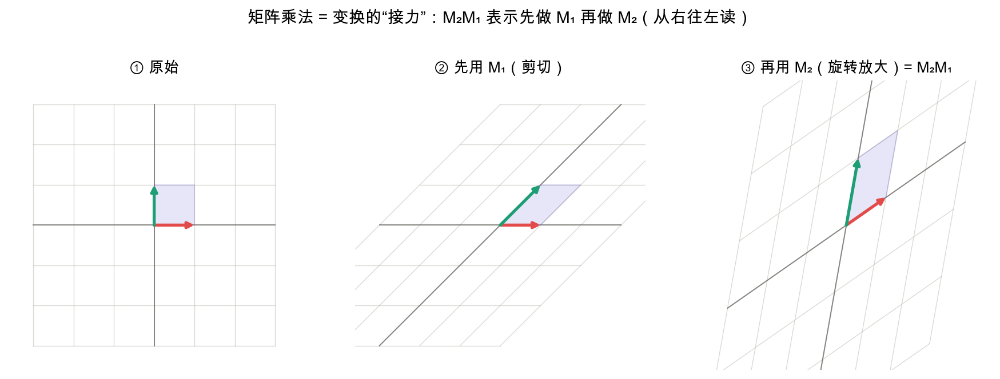

$AB$ 不是"数字对应相乘",而是"**先做 $B$ 这个变换,再做 $A$ 这个变换**":$(AB)\mathbf v=A(B\mathbf v)$。所以矩阵乘法**从右往左读**,满足结合律但一般 $AB\neq BA$(先穿袜子再穿鞋 ≠ 先穿鞋再穿袜子)。

**在深度学习中**:深层网络是一连串变换接力。但有个关键警示——**纯线性变换的叠加仍是线性的**($W_2W_1\mathbf x$ 等价于单个矩阵;考虑偏置则是仿射∘仿射仍为仿射,同样塌成一层)。这正是为什么每层之间**必须插入非线性激活函数**(ReLU/tanh),否则再多层也等价于一层。(注意区分:$AB$ 是矩阵乘法,与逐元素的 Hadamard 积 $\odot$ 不同。)

## 3. 行列式:面积 / 体积缩放了多少

📖 **权威详解**:[行列式 · Wikipedia](https://zh.wikipedia.org/wiki/行列式)

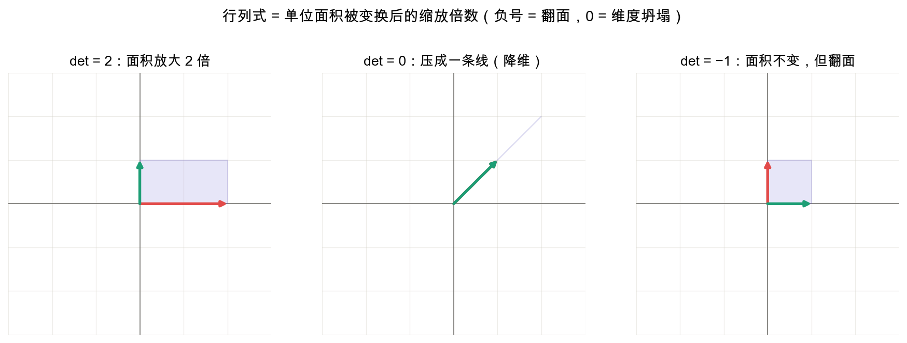

行列式的**绝对值** $|\det A|$ $=$ 变换把单位面积放大成了几倍,**符号**编码定向:$\det=2$ 面积翻倍、定向不变;$\det=-2$ 面积翻倍但空间被翻面;$\det=0$ 把平面压成一条线甚至一点(维度坍塌)。二阶公式:
$$\det\begin{bmatrix}a&b\\c&d\end{bmatrix}=ad-bc$$
**在深度学习中**:① $\det=0$ 意味着信息被压扁、不可恢复,是"不可逆"的几何信号;② Normalizing Flows(一类生成模型)需计算变换雅可比的 $\log|\det J|$ 来追踪概率密度的缩放。

## 4. 逆矩阵:把变换倒回去

📖 **权威详解**:[逆矩阵 · Wikipedia](https://zh.wikipedia.org/wiki/逆矩阵)

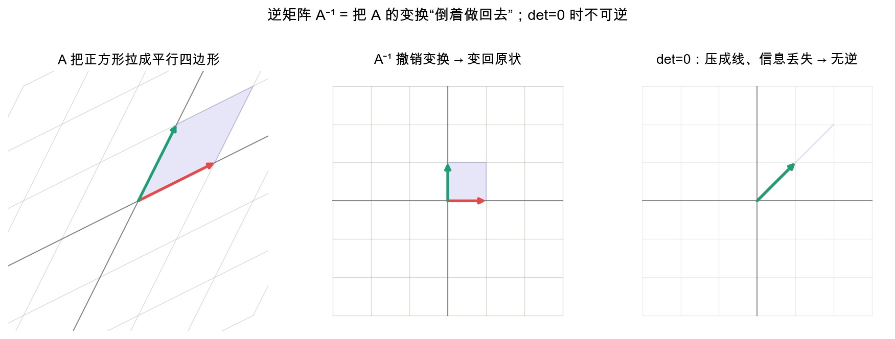

$A^{-1}$ 是"撤销键":$A$ 把空间怎么搬过去,$A^{-1}$ 原样搬回来,$A^{-1}A=I$。但若 $A$ 把面积压成 0($\det A=0$),信息已丢,不存在撤销键——故 $A^{-1}$ 存在 $\iff \det A\neq 0$。解线性方程组即 $A\mathbf x=\mathbf b\Rightarrow\mathbf x=A^{-1}\mathbf b$。

**在深度学习中**:线性回归的解析解 $\mathbf w=(X^\top X)^{-1}X^\top\mathbf y$(最小二乘)就靠求逆;当 $X^\top X$ 病态/不可逆时,用**伪逆**或加正则(岭回归 $+\lambda I$)来救——这也是正则化的一个几何理由。工程上很少真去算 $A^{-1}$(数值不稳、慢),而是解方程或用分解(LU/QR);求逆更多是**理解工具**。

## 5. 点积与对偶性:投影与相似度

📖 **权威详解**:[点积 · Wikipedia](https://zh.wikipedia.org/wiki/点积)

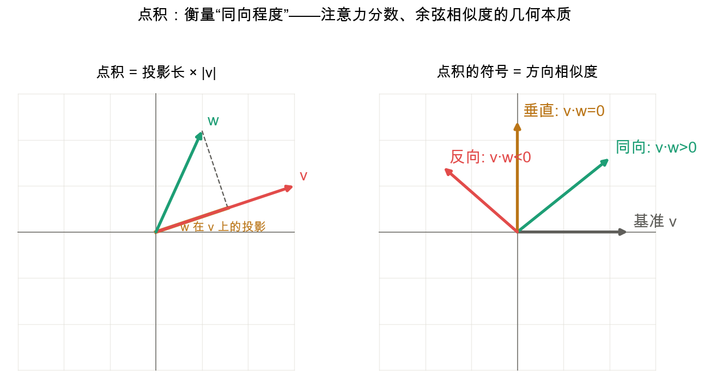

点积 $\mathbf v\cdot\mathbf w$ 衡量"两个向量有多同向":同向为正、垂直为 0、反向为负。它有两种写法——
$$\mathbf v\cdot\mathbf w=\sum_i v_iw_i=\lVert\mathbf v\rVert\,\lVert\mathbf w\rVert\cos\theta,\qquad \operatorname{proj}_{\mathbf v}\mathbf w=\frac{\mathbf v\cdot\mathbf w}{\mathbf v\cdot\mathbf v}\,\mathbf v$$
其中左边 $\sum_i v_iw_i$ 是**代数式**(点积的定义),右边 $\lVert\mathbf v\rVert\lVert\mathbf w\rVert\cos\theta$ 是**几何式**(需要证明的定理,见下);$\operatorname{proj}_{\mathbf v}\mathbf w$ 是 $\mathbf w$ 沿 $\mathbf v$ 的投影向量。

**在深度学习中**:点积无处不在——单个神经元 $\mathbf w\cdot\mathbf x$ 是输入与权重的匹配度;注意力分数 $QK^\top$ 是 query 与 key 两两点积的相关度;余弦相似度 / 向量检索(RAG)靠归一化点积找最相似的 embedding。凡是"算相似度/匹配度"的地方,底下基本都是它。

### ★ 重点论证:点积的代数式与几何式为何必然相等

点积**只有代数式 $\sum_i v_iw_i$ 是"定义"**,几何式 $\lVert\mathbf v\rVert\lVert\mathbf w\rVert\cos\theta$ 是要被证明的"定理"——两者看起来毫不相干,凭什么相等?下面用"**线性函数 ⇄ 向量**"的对偶把它推出来,全程同一组数:$\mathbf v=(4,3)$、$\hat{\mathbf u}=\mathbf v/\lVert\mathbf v\rVert=(0.8,0.6)$、$\mathbf w=(0,5)$。先定准:$f:\mathbb R^2\to\mathbb R$ 线性 $\iff$ 同时满足可加性与齐次性。

**第 1 步 · 线性函数 $f$ 由 $f(\hat\imath)$、$f(\hat\jmath)$ 完全确定。**

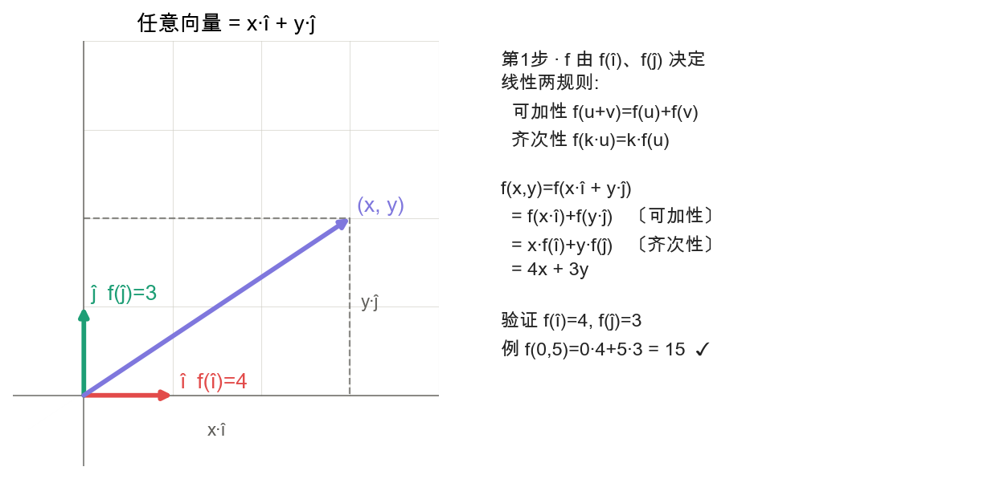

- $f(x,y)=f(x\hat\imath+y\hat\jmath)$ 〔按基分解 $(x,y)=x\hat\imath+y\hat\jmath$ 代入〕
- $\qquad\ =f(x\hat\imath)+f(y\hat\jmath)$ 〔可加性〕
- $\qquad\ =x\,f(\hat\imath)+y\,f(\hat\jmath)$ 〔齐次性两次〕

记 $a=f(\hat\imath),\ b=f(\hat\jmath)$,得 $f(x,y)=ax+by$。例:取 $f(\hat\imath)=4,\ f(\hat\jmath)=3\Rightarrow f(x,y)=4x+3y$,$f(0,5)=15$。

**第 2 步 · 这两个数 $(a,b)$ 构成向量 $\mathbf v$,且 $f(\mathbf w)=\mathbf v\cdot\mathbf w$。**

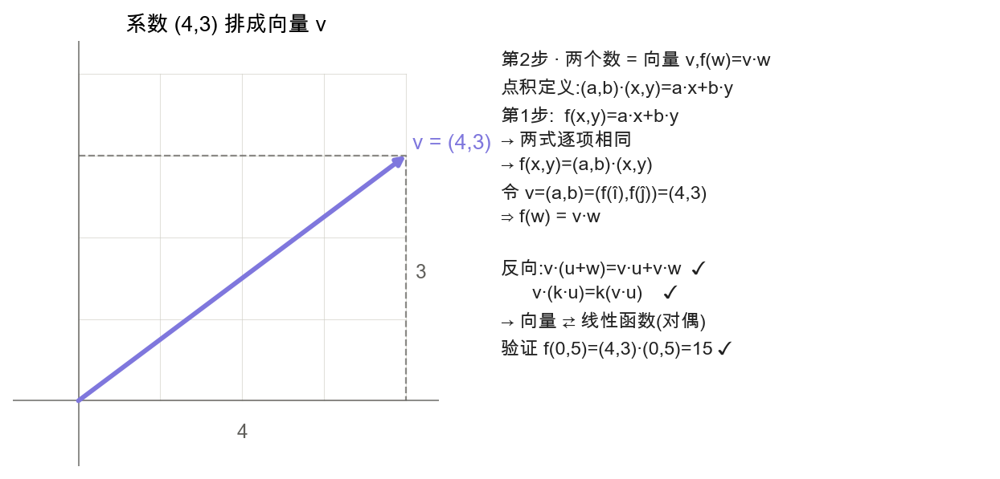

点积的代数定义 $(a,b)\cdot(x,y)=ax+by$ 与第 1 步的 $f(x,y)=ax+by$ **逐项相同**,故 $f(\mathbf w)=\mathbf v\cdot\mathbf w$,其中 $\mathbf v=(a,b)=(f(\hat\imath),f(\hat\jmath))=(4,3)$。反向也成立:每个向量都给出一个线性函数,且两个方向用的是同一组系数,互为逆映射,构成**双射**——这就是"**对偶**"的精确含义:线性函数与向量一一对应。

**第 3 步 · "投影到直线 $L$"这个线性函数,对应的向量正是单位向量 $\hat{\mathbf u}$。**

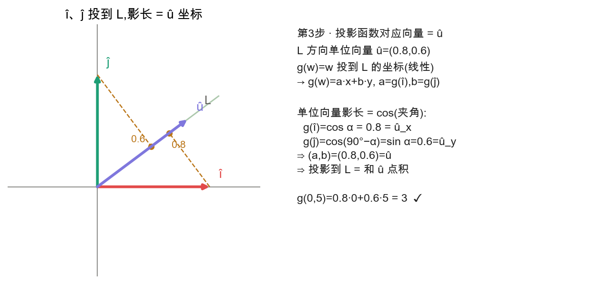

设 $L$ 过原点、单位方向 $\hat{\mathbf u}=(\cos\alpha,\sin\alpha)$,令 $g(\mathbf w)=\mathbf w$ 在 $L$ 上的投影坐标。**投影是线性的**(因 $L$ 过原点,正交投影满足可加性与齐次性),故套第 1 步:$g(\mathbf w)=ax+by$,$a=g(\hat\imath),\ b=g(\hat\jmath)$。用"单位向量的影长 $=\cos$(夹角)":$g(\hat\imath)=\cos\alpha=\hat u_x$、$g(\hat\jmath)=\sin\alpha=\hat u_y$,于是 $(a,b)=\hat{\mathbf u}$,即 $g(\mathbf w)=\hat{\mathbf u}\cdot\mathbf w$——**"投影到 $L$" 就是 "和单位向量 $\hat{\mathbf u}$ 做点积"**。

**第 4 步 · 一般 $\mathbf v$,推出几何式 = 代数式。**

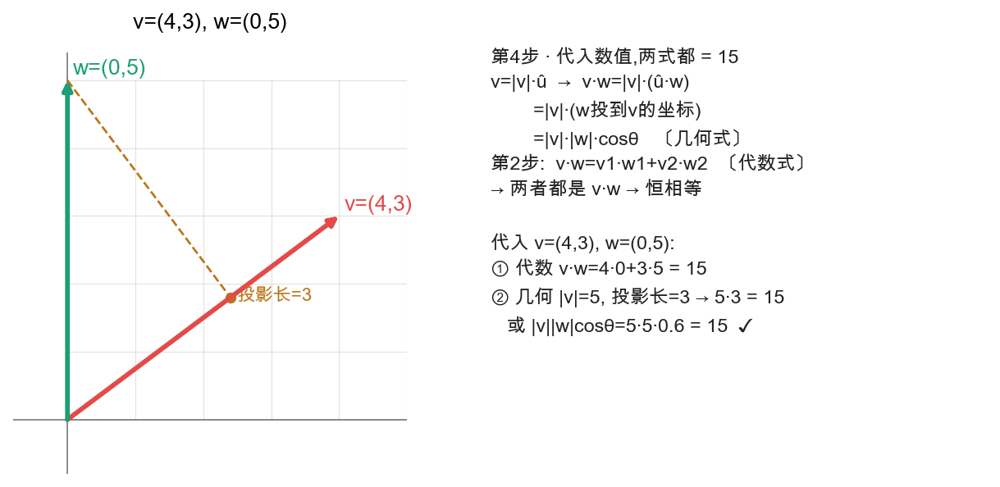

从代数定义出发,把 $\mathbf v$ 写成 $\mathbf v=\lVert\mathbf v\rVert\,\hat{\mathbf u}$,用点积的双线性:
$$\mathbf v\cdot\mathbf w=\lVert\mathbf v\rVert\,(\hat{\mathbf u}\cdot\mathbf w)=\lVert\mathbf v\rVert\,\lVert\mathbf w\rVert\cos\theta$$
中间一步用**第 3 步**:$\hat{\mathbf u}\cdot\mathbf w$ 正是 $\mathbf w$ 投到 $\mathbf v$ 方向的投影坐标,等于 $\lVert\mathbf w\rVert\cos\theta$。全程从代数定义出发,只在中间用第 3 步那座"几何 = 代数"的桥,推出几何式——**没有第 3 步,两式互不相关**。代入验证:代数 $4\cdot0+3\cdot5=15$;几何 $\lVert\mathbf v\rVert\cdot$ 投影长 $=5\cdot3=15$。

**另证(余弦定理,直接适用任意维度)**:由 $\lVert\mathbf w-\mathbf v\rVert^2=\lVert\mathbf v\rVert^2+\lVert\mathbf w\rVert^2-2\lVert\mathbf v\rVert\lVert\mathbf w\rVert\cos\theta$(余弦定理)与 $\lVert\mathbf w-\mathbf v\rVert^2=\sum_i(w_i-v_i)^2=\lVert\mathbf w\rVert^2+\lVert\mathbf v\rVert^2-2\sum_i v_iw_i$(代数展开)相减,即得 $\sum_i v_iw_i=\lVert\mathbf v\rVert\lVert\mathbf w\rVert\cos\theta$。高维无需新证明:两个向量连同原点这三点永远只张成一个 $\le 2$ 维平面,夹角就定义在这张平面里。

## 6. 基变换:换一个坐标系看同一向量

📖 **权威详解**:[基(线性代数) · Wikipedia](https://zh.wikipedia.org/wiki/基_%28線性代數%29)

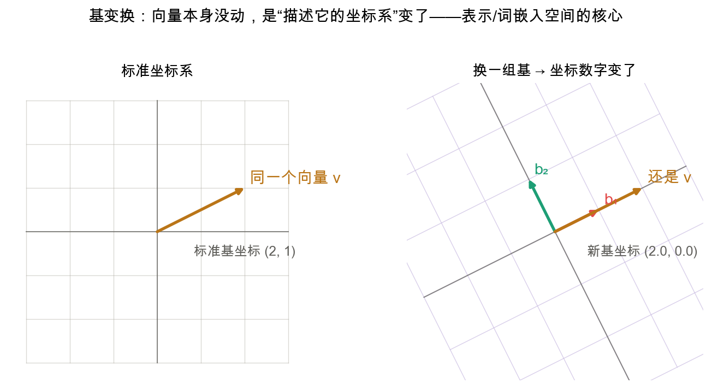

向量本身是客观存在的箭头,但"坐标 $(2,1)$"只相对于**某一组基**才有意义。换一组基,同一个箭头的坐标数字就变了——坐标是语言,向量是被描述的事物。若新基的列向量(用标准坐标写)组成矩阵 $B$,则 $[\mathbf v]_B=B^{-1}\mathbf v$;同一变换在新基下表示为 $B^{-1}AB$(右起读:$B$ 换回标准坐标 → $A$ 施加变换 → $B^{-1}$ 换回新基),称 $A$ 与 $B^{-1}AB$ 为**相似矩阵**。

**在深度学习中**:表示学习的核心就是"找一组好基"。词嵌入把词放进语义坐标系;**PCA 本质是换到一组标准正交的新基(数据协方差矩阵的特征向量)**——保留方差大的几条轴、砍掉方差小的轴即完成降维;白化(whitening)也是一次基变换,让特征去相关。

## 7. 特征值 / 特征向量:方向不变的特殊方向

📖 **权威详解**:[特征值和特征向量 · Wikipedia](https://zh.wikipedia.org/wiki/特征值和特征向量)

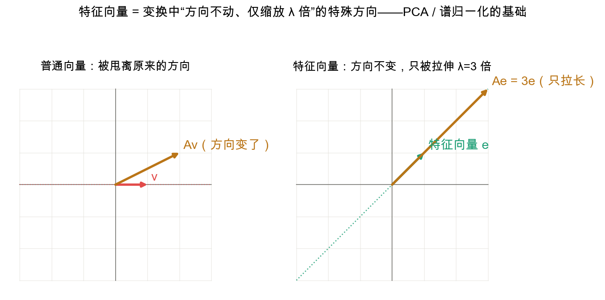

大多数向量经变换会被甩偏(方向改变),但有些特殊方向上的向量,变换后**仍停在自己那条直线上**,只是被拉长/压缩 $\lambda$ 倍——这些方向是**特征向量**,$\lambda$ 是对应**特征值**,它们是变换"最本质的骨架":
$$A\mathbf e=\lambda\mathbf e\ (\mathbf e\neq\mathbf 0),\qquad \det(A-\lambda I)=0$$
**在深度学习中**:① **PCA**——协方差矩阵实对称半正定,有一组正交实特征向量、特征值非负;这组正交向量即主成分,特征值 = 该方向方差,据此降维;② **谱归一化**——用最大奇异值 $\sigma_{\max}(W)$(注意是奇异值,不是最大特征值:$W$ 通常非方非对称)约束每层 Lipschitz 常数,稳住训练;③ **优化**——损失的 Hessian 特征值决定地形陡峭程度,条件数越大梯度下降越慢。实战更常用**奇异值分解 SVD** $A=U\Sigma V^\top$,它把对称矩阵的特征分解推广到任意(含非方)矩阵,核心量是非负的奇异值 $\sigma=\sqrt{\lambda(A^\top A)}$;PCA、谱归一化、低秩压缩(LoRA 的思想)背后都是它。([奇异值分解](https://zh.wikipedia.org/wiki/奇异值分解))

## 关键公式速查
- **矩阵乘向量**:$A\mathbf v=x\,\text{col}_1+y\,\text{col}_2$ — 对列做加权求和;
- **变换复合**:$(AB)\mathbf v=A(B\mathbf v)$ — 从右往左做,不可交换;
- **行列式(2×2)**:$ad-bc$ — 面积缩放,0 = 坍塌;
- **逆矩阵**:$A^{-1}A=I$,存在 $\iff\det A\neq0$ — 撤销变换;
- **点积**:$\mathbf v\cdot\mathbf w=\sum_i v_iw_i=\lVert\mathbf v\rVert\lVert\mathbf w\rVert\cos\theta$ — 同向程度;
- **基变换**:$[\mathbf v]_B=B^{-1}\mathbf v$,变换 $B^{-1}AB$ — 换坐标系;
- **特征**:$A\mathbf e=\lambda\mathbf e$ — 方向不变、缩放 $\lambda$;
- **SVD**:$A=U\Sigma V^\top$ — 特征分解对任意矩阵的推广($\Sigma$ 对角元是奇异值)。

## 应掌握的要点
- **矩阵 = 空间变换,列 = 基向量落点**,这是钥匙,其余皆推论;
- 矩阵乘法 = 变换接力(从右往左);线性叠加仍线性,故神经网络**必须有非线性激活**;
- 行列式 = 面积缩放,$\det=0$ = 维度坍塌 = 不可逆;
- 点积 = 投影长 × 长度 = 同向程度;只有代数式是定义,几何式经对偶/余弦定理被证明;
- 基变换 = 换坐标系,特征向量 = 方向不变的轴——PCA / SVD 的根基。

---
### 参考链接
- [3Blue1Brown《线性代数的本质》](https://www.3blue1brown.com/topics/linear-algebra) — 几何直觉来源
- [d2l 2.3 线性代数](https://zh.d2l.ai/chapter_preliminaries/linear-algebra.html)(记号与公式锚定此页)
