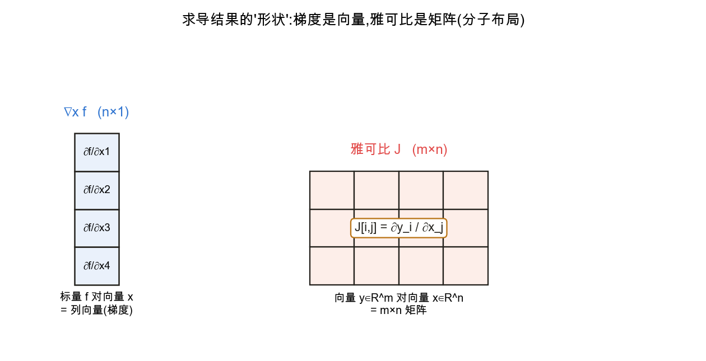

<!--# matcalc -->
# 矩阵求导(按需)

> 反向传播本质是**向量化的链式法则**。框架(PyTorch 等)会自动求导,但要看懂梯度的**形状**、推导自定义层、或读论文里的梯度公式,需要矩阵求导的基本约定与几条常用恒等式。这一节是查阅性质的"按需"补充,深挖请直接看文末权威源。记号锚定 d2l 2.4。

## 1. 求导结果的"形状"与布局约定

📖 **权威详解**:[矩阵微积分 · Wikipedia](https://zh.wikipedia.org/wiki/矩阵微积分)

标量对向量求导得**梯度**(与自变量同形的向量);向量对向量求导得**雅可比矩阵**。存在两种排列约定,务必先约定清楚:

- **分子布局(numerator layout)**:结果行数随分子、列数随分母。向量 $\mathbf y\in\mathbb R^m$ 对 $\mathbf x\in\mathbb R^n$ 的雅可比是 $m\times n$ 矩阵,$J_{ij}=\dfrac{\partial y_i}{\partial x_j}$。
- **分母布局(denominator layout)**:与上互为转置。

本库统一用**分母布局表达梯度**(即 $\nabla_{\mathbf x}f$ 与 $\mathbf x$ 同形,这是深度学习的惯例),用**分子布局表达雅可比**。两种布局只差一个转置,混用是公式对不上的头号原因。

## 2. 梯度与雅可比

📖 **权威详解**:[雅可比矩阵 · Wikipedia](https://zh.wikipedia.org/wiki/雅可比矩阵)

标量 $f$ 对向量 $\mathbf x\in\mathbb R^n$:**梯度** $\nabla_{\mathbf x}f=\big[\frac{\partial f}{\partial x_1},\dots,\frac{\partial f}{\partial x_n}\big]^\top\in\mathbb R^n$。

向量 $\mathbf y\in\mathbb R^m$ 对 $\mathbf x\in\mathbb R^n$:**雅可比**
$$J=\frac{\partial \mathbf y}{\partial \mathbf x}\in\mathbb R^{m\times n},\qquad J_{ij}=\frac{\partial y_i}{\partial x_j}$$
标量对矩阵 $W$ 求导,结果与 $W$ 同形:$\big(\nabla_W f\big)_{ij}=\dfrac{\partial f}{\partial W_{ij}}$——这正是更新某层权重时要算的东西。

## 3. 深度学习常用求导恒等式(速查)

这几条在线性回归、反向传播里反复出现(以分母布局给出梯度):

- $\nabla_{\mathbf x}(\mathbf a^\top\mathbf x)=\mathbf a$;
- $\nabla_{\mathbf x}\lVert\mathbf x\rVert^2=\nabla_{\mathbf x}(\mathbf x^\top\mathbf x)=2\mathbf x$;
- $\nabla_{\mathbf x}(\mathbf x^\top A\mathbf x)=(A+A^\top)\mathbf x$,当 $A$ 对称时 $=2A\mathbf x$;
- $\dfrac{\partial (A\mathbf x)}{\partial \mathbf x}=A$(雅可比,分子布局);
- **最小二乘**:$f=\lVert X\mathbf w-\mathbf y\rVert^2\Rightarrow \nabla_{\mathbf w}f=2X^\top(X\mathbf w-\mathbf y)$,令其为 0 即得解析解 $\mathbf w=(X^\top X)^{-1}X^\top\mathbf y$。

完整恒等式表见 *The Matrix Cookbook*(文末)。

## 4. 链式法则的矩阵形式 → 反向传播

📖 **权威详解**:[反向传播算法 · Wikipedia](https://zh.wikipedia.org/wiki/反向传播算法)

多层网络 $\mathbf x\to\mathbf y\to\mathbf z$,标量损失对输入的梯度,等于**雅可比连乘**:
$$\frac{\partial \mathcal L}{\partial \mathbf x}=\Big(\frac{\partial \mathbf y}{\partial \mathbf x}\Big)^{\!\top}\Big(\frac{\partial \mathbf z}{\partial \mathbf y}\Big)^{\!\top}\frac{\partial \mathcal L}{\partial \mathbf z}$$
反向传播之所以高效,是因为它**从损失端开始、用"向量 × 雅可比"的顺序回乘**(vector-Jacobian product),始终只传播一个与该层输出同形的向量,而无需显式构造、相乘庞大的雅可比矩阵。这就是 [微积分 · 链式法则](node:calc#链式法则) 的向量化落地。

## 应掌握的要点
- 先约定布局(分母布局表梯度、分子布局表雅可比),否则公式差一个转置;
- 记住几条高频恒等式:$\nabla\lVert\mathbf x\rVert^2=2\mathbf x$、$\nabla(\mathbf x^\top A\mathbf x)=(A+A^\top)\mathbf x$、$\partial(A\mathbf x)/\partial\mathbf x=A$;
- 最小二乘梯度 $2X^\top(X\mathbf w-\mathbf y)$ 与解析解 $(X^\top X)^{-1}X^\top\mathbf y$;
- 反向传播 = 雅可比连乘,实现上是从损失端回乘的 vector-Jacobian product。

---
### 参考链接
- [The Matrix Cookbook (PDF)](https://www.math.uwaterloo.ca/~hwolkowi/matrixcookbook.pdf) — 矩阵求导恒等式权威速查手册
- [The Matrix Calculus You Need For Deep Learning](https://explained.ai/matrix-calculus/) — 面向深度学习、从零讲清矩阵求导(Parr & Howard)
- [矩阵微积分 · Wikipedia](https://zh.wikipedia.org/wiki/矩阵微积分)、[d2l 2.4 微积分](https://zh.d2l.ai/chapter_preliminaries/calculus.html)
