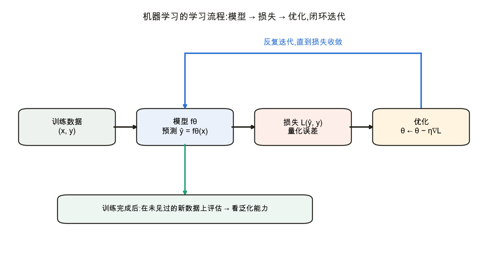
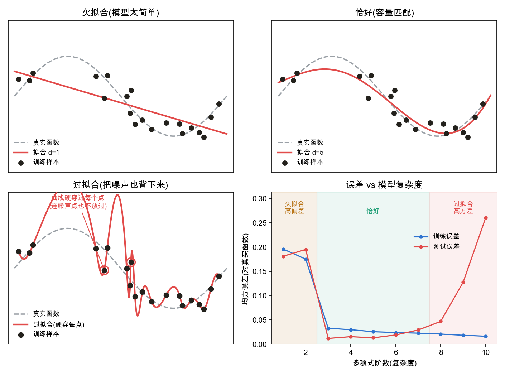

<!--# mlwhat -->
# 机器学习概述

> 在进入具体模型(线性回归、分类、神经网络)之前,先建立整体图景:机器学习在解决什么问题、用什么方法论、一个"学习过程"由哪些部件构成。后续每个模型都是这套框架的具体化——理解了它,再看公式就有了挂靠点。

## 1. 什么是机器学习:从"写规则"到"从数据中学"

📌 **概念定位**:本节建立全书统一框架;后续模型会依次落到 [线性回归](node:linreg)、[逻辑回归 / softmax 回归](node:softmax) 和 [深度学习](node:dl)。

传统编程是人把规则写死:输入经过人工设计的逻辑得到输出。但很多任务(识别图像、翻译、预测)规则极其复杂、难以穷举。**机器学习换了个思路:不写规则,而是给模型大量"输入 → 正确答案"的样本,让它自动调整内部参数,从数据中归纳出规律**,再用学到的规律处理新输入。

一个被广泛引用的定义(Tom Mitchell):一个程序,若其在任务 $T$ 上的表现(用性能度量 $P$ 衡量)随经验 $E$(数据)增多而提升,就称它在"学习"。三要素 $T/P/E$ 分别回答:要做什么、好坏怎么量、从什么数据学。

## 2. 机器学习的版图

📌 **主线范围**:本库以监督学习为主线,先讲回归与分类,再进入多层神经网络。

按"数据带不带答案"分三大类:
- **监督学习**:数据含标签(输入 + 正确答案)。又分**回归**(输出连续值,如房价)与**分类**(输出离散类别,如猫 / 狗)。**本库主线**。
- **无监督学习**:数据无标签,挖掘内在结构(聚类、降维如 PCA)。
- **强化学习**:智能体与环境交互,靠奖励信号学策略(如 AlphaGo)。

**深度学习不是另起一类**,而是上述范式中**用多层神经网络做"模型"**的那一支;它与线性模型共享同一套"训练"框架。

## 3. 一个完整的学习流程(全书的统一骨架)

监督学习的训练可拆成四个部件,循环往复:

1. **模型(假设空间)**:一族带参数 $\theta$ 的函数 $f_\theta$,规定"可能的规律长什么样"(如线性回归限定为直线)。训练就是在这族函数里挑参数。
2. **损失函数**:衡量当前预测 $\hat y=f_\theta(x)$ 与真实 $y$ 差多少(下一节)。
3. **优化算法**:按损失调参数,使损失下降——核心是梯度下降(第 5 节)。
4. **评估**:在没参与训练的数据上看表现,即泛化(第 6 节)。

后面的线性回归、softmax、MLP…… 都只是把"模型"和"损失"换成具体形式,这套流程不变。

## 4. 损失函数:把"错得多严重"变成一个数

要量化模型错得多严重,需要**损失函数 $L(\hat y,y)$**——一个标量,预测越偏离真值越大;训练就是最小化它。两类任务有各自的标准损失,且都能由 [概率](node:prob) 节的极大似然导出:
- 回归 → **均方误差 MSE**:$\frac1n\sum_i(\hat y_i-y_i)^2$(对应高斯噪声假设);
- 分类 → **交叉熵**:$-\frac1n\sum_i\log q_{y_i}$(对应类别分布假设)。

(为什么恰是这两个、以及它们与极大似然的关系,见 [数学基础 · 概率 §5–6](node:prob#极大似然)。)

## 5. 优化:沿负梯度下降

有了损失,就沿梯度改参数:计算损失对每个参数的梯度 $\nabla_\theta L$,沿**负梯度**方向走一小步:
$$\theta\leftarrow\theta-\eta\,\nabla_\theta L$$
$\eta$ 是学习率。反复迭代,损失逐步降到(局部)最小——这正是 [微积分 · 梯度](node:calc#梯度) 的用武之地。实践中用**小批量随机梯度下降(SGD)**:每次只用一小批样本估计梯度,兼顾效率与稳定。

## 6. 泛化与过拟合:真正的目标是"新数据"

📌 **后续承接**:模型容量与泛化问题会在 [多层感知机](node:mlp) 和后续实验主线中反复出现。

关键认识:**机器学习要的不是在训练集上考满分,而是在没见过的新数据上表现好——这叫泛化**。一味降低训练损失会掉进陷阱:

- **欠拟合**:模型太简单,训练与测试都差(没学到规律);
- **过拟合**:模型太复杂,把训练数据连噪声一起背下来,训练误差极低但测试误差飙升;
- **恰好**:容量与问题匹配,泛化最好。

随模型复杂度增加,训练误差单调下降,但测试误差**先降后升**(右图 U 形),最优点在中间。**对抗过拟合**的常用手段:更多数据、正则化(权重衰减 L2、Dropout)、限制模型容量、早停——它们会在各模型节里具体出现。

## 应掌握的要点
- 机器学习 = 从数据学规律(而非人写规则);三要素 $T/P/E$;
- 监督学习含回归(连续)与分类(离散),是本库主线;深度学习是其中"多层神经网络"那一支;
- 统一流程:**模型 → 损失 → 优化 → 评估**,后续所有模型都在此框架内;
- 训练 = 用梯度下降最小化损失;但**目标是泛化,不是记住训练集**;
- 欠拟合 / 过拟合的权衡,以及对抗过拟合的基本手段。

---
### 参考链接
- [d2l 引言](https://zh.d2l.ai/chapter_introduction/index.html)
- [机器学习 · Wikipedia](https://zh.wikipedia.org/wiki/机器学习) · [监督学习](https://zh.wikipedia.org/wiki/监督学习) · [过拟合](https://zh.wikipedia.org/wiki/過適)
