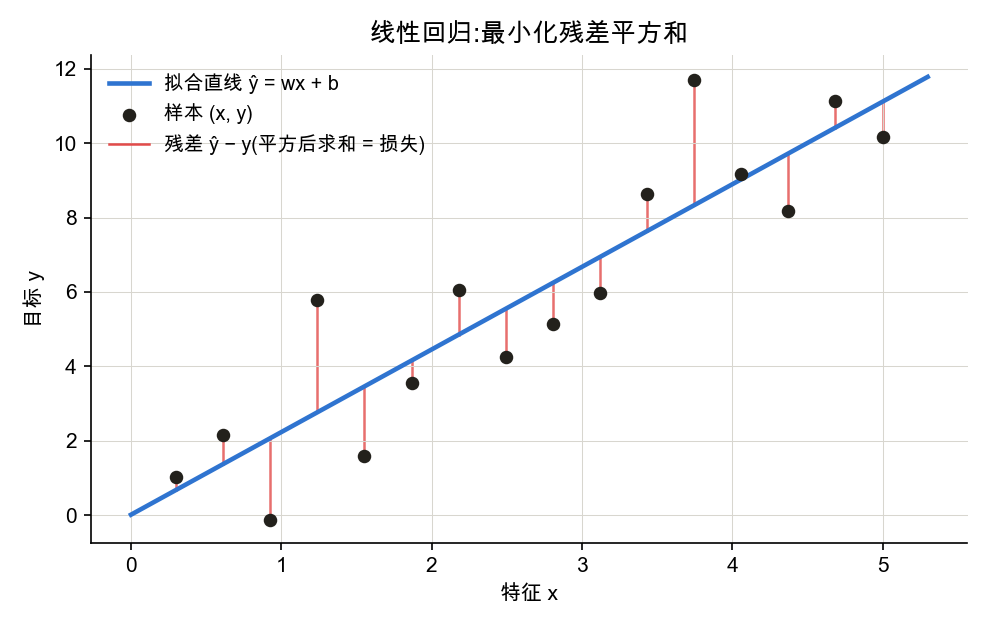
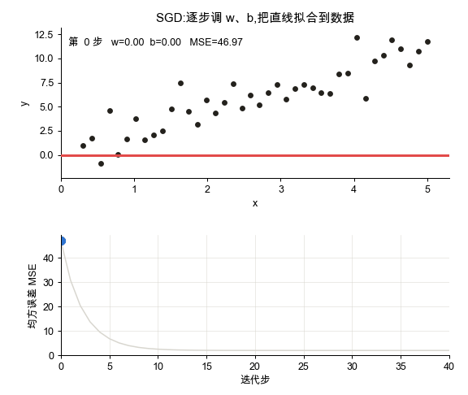
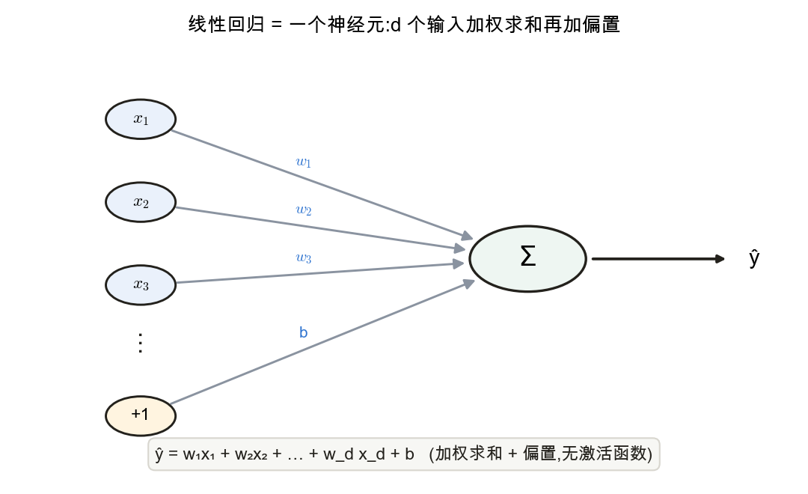

<!--# linreg -->
# 线性回归:第一个完整的"训练"模板

> 线性回归是最简单的模型,但**模型 → 损失 → 优化这一完整训练流程在此首次完整出现**;后续所有模型(含神经网络)都是在该模板上扩展。公式与记号锚定 d2l 3.1。

## 1. 模型:加权和 + 偏置
单样本(向量形式)与批量(矩阵形式):
$$\hat{y}=\mathbf w^\top\mathbf x+b,\qquad\qquad \hat{\mathbf y}=\mathbf X\mathbf w+b$$
其中 $\mathbf X\in\mathbb R^{n\times d}$ 每行一个样本、每列一个特征,$\mathbf w\in\mathbb R^{d}$ 为权重,$b$ 为标量偏置。每个特征配一个权重(表示其重要程度),加权求和后再加偏置;几何上是用一条直线 / 超平面拟合数据。

## 2. 损失:平方误差
单样本与整体损失(d2l 采用 $\tfrac12$ 系数,仅为求导后约去,不影响最优解):
$$l^{(i)}(\mathbf w,b)=\tfrac12\big(\hat y^{(i)}-y^{(i)}\big)^2,\qquad L(\mathbf w,b)=\frac1n\sum_{i=1}^{n}\tfrac12\big(\mathbf w^\top\mathbf x^{(i)}+b-y^{(i)}\big)^2$$
采用平方的原因:① 处处可导(便于求梯度);② 误差越大惩罚越重;③ 等价于高斯噪声假设下的极大似然(见第 5 节)。

## 3. 解析解:线性回归的特例
将 $b$ 并入 $\mathbf w$(在 $\mathbf X$ 上附加一列全 $1$),最小化均方误差存在**闭式解**:
$$\mathbf w^{*}=(\mathbf X^\top\mathbf X)^{-1}\mathbf X^\top\mathbf y$$
由 $\nabla_{\mathbf w}L=\mathbf 0$ 解出。需强调:这种闭式解是线性回归的特例;绝大多数模型(尤其神经网络)不存在解析解,只能依赖梯度下降。

## 4. 小批量随机梯度下降(SGD)
每次取一小批 $\mathcal B$ 计算梯度并更新(兼顾效率与稳定):
$$\mathbf w\leftarrow\mathbf w-\frac{\eta}{|\mathcal B|}\sum_{i\in\mathcal B}\mathbf x^{(i)}\big(\mathbf w^\top\mathbf x^{(i)}+b-y^{(i)}\big)$$
$$b\leftarrow b-\frac{\eta}{|\mathcal B|}\sum_{i\in\mathcal B}\big(\mathbf w^\top\mathbf x^{(i)}+b-y^{(i)}\big)$$
括号内 $(\hat y-y)$ 为**残差**,更新量正比于"残差 × 输入"。学习率 $\eta$ 与批量大小 $|\mathcal B|$ 为超参数:$\eta$ 过大发散、过小收敛慢。

## 5. 平方损失的由来:高斯噪声下的极大似然
设 $y=\mathbf w^\top\mathbf x+b+\epsilon,\ \ \epsilon\sim\mathcal N(0,\sigma^2)$,则
$$P(y\mid\mathbf x)=\frac{1}{\sqrt{2\pi\sigma^2}}\exp\!\Big(-\frac{1}{2\sigma^2}\big(y-\mathbf w^\top\mathbf x-b\big)^2\Big)$$
取负对数似然并略去与参数无关的项后,**最小化负对数似然等价于最小化平方误差**。这是平方损失的理论依据。

## 6. 线性回归即最简单的神经网络
把它画成**网络图**就一目了然:$d$ 个输入特征,每个配一个权重 $w_i$,加权求和后再加偏置 $b$,汇入**一个输出神经元**得到 $\hat y$——中间**没有激活函数**。这正是"神经元"的原型。

它是通往深度网络的接口:后续的神经网络可视为"**大量此类单元 + 非线性激活 + 多层堆叠**"。换言之,把这张图复制很多份、层层相连、每个神经元后面加一个非线性激活,就得到了多层感知机(下一章)。

## 常见问题
- 特征量纲差异大时需**标准化**,否则梯度下降方向偏斜、收敛缓慢。
- 学习率为最敏感超参:损失变为 NaN 或发散,通常因 $\eta$ 过大。

## 应掌握的要点
能写出模型 $\hat y=\mathbf w^\top\mathbf x+b$、平方损失与 SGD 更新式;理解解析解为特例、而深度学习依赖 SGD;以及"线性回归是最简单的神经网络"这一视角。

---
### 参考链接
- [d2l 3.1 线性回归](https://zh.d2l.ai/chapter_linear-networks/linear-regression.html)(公式记号锚定此页)· [3.2 从零实现](https://zh.d2l.ai/chapter_linear-networks/linear-regression-scratch.html) · [3.3 简洁实现](https://zh.d2l.ai/chapter_linear-networks/linear-regression-concise.html)
- 动手学深度学习 v2「08 线性回归 + 基础优化算法」(见[视频合集](https://www.youtube.com/playlist?list=PLQtPj5OvXSt9SwJnrYu_45_-S6oKQqyxW))
- [线性回归](https://zh.wikipedia.org/wiki/线性回归) · [最小二乘法](https://zh.wikipedia.org/wiki/最小二乘法)(维基百科)
