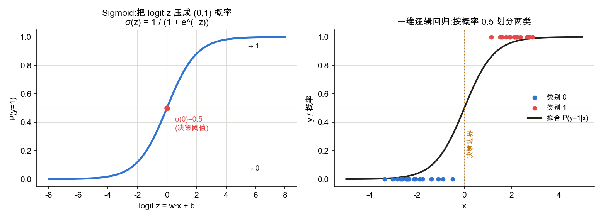
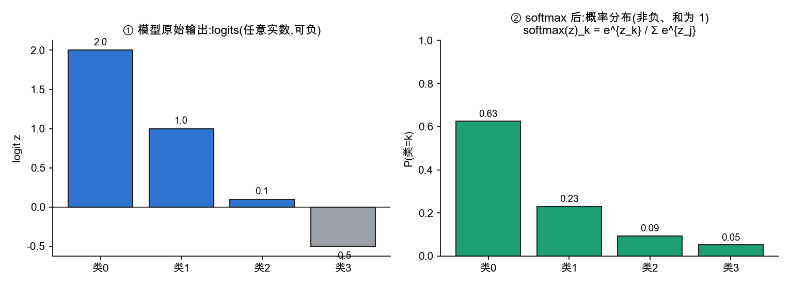
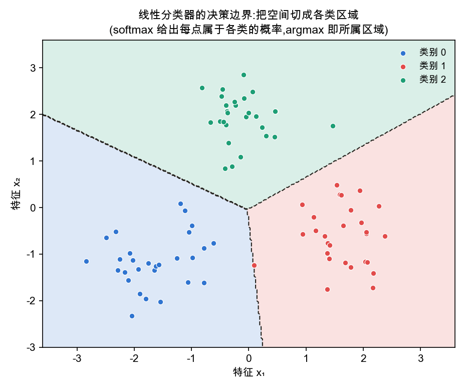

<!--# softmax -->
# 逻辑回归 / softmax 回归

> 这一节讲一条连贯的主线:**从线性回归的"打分",如何一步步改造成"输出类别概率"的分类器**——为什么必须是 sigmoid、为什么损失是交叉熵、又如何从二分类推广到多分类的 softmax。每个选择都不是拍脑袋,而是被同一个目标("把无界的打分翻译成概率")逼出来的。记号锚定 d2l 3.4。

## 一、逻辑回归(二分类)

### 1. 从线性回归到分类

线性回归给出的是一个**实数打分** $z=\mathbf w\cdot\mathbf x+b\in\mathbb R$:拟合连续目标很好,但分类要的不是任意实数,而是**类别**,更有用的是**属于各类的概率**——一个落在 $[0,1]$、可比较、可优化的量。

直接拿线性打分 $z$ 当类别或概率有几处硬伤:$z$ **无界**(可正可负、可以很大),没有概率含义;若用它配平方误差去逼近 0/1 标签,会对"已经分对、但离边界很远"的点施加莫名的惩罚,对离群点也不稳健。因此需要在打分之上,套一个把实数映射成概率的函数——下一节给出这个函数,逻辑回归的模型也就此定义。

### 2. 模型:用 sigmoid 把打分变成概率

打分 $z=\mathbf w\cdot\mathbf x+b$ 取值遍及 $(-\infty,+\infty)$,而概率 $p$ 只在 $[0,1]$,两者**范围不匹配**,不能直接令 $p=z$。可行的做法是:**把概率 $p$ 逐步改造成一个同样能取遍整条实数轴的量,再令它等于打分 $z$**。分两步改造:

- **第一步——几率** $\dfrac{p}{1-p}$:把 $[0,1]$ 拉到 $[0,+\infty)$($p\to1$ 时趋于 $\infty$),含义是"正类比负类的可能性倍数";
- **第二步——对数几率** $\ln\dfrac{p}{1-p}$(几率再取对数):把 $[0,+\infty)$ 拉到 $(-\infty,+\infty)$,范围终于和打分一致;它还有个好处——让各特征的"证据"在对数尺度上**可加**,正是线性模型擅长的形式。

现在两边范围一致,令对数几率等于打分:
$$\ln\frac{p}{1-p}=z=\mathbf w\cdot\mathbf x+b.$$
反解出 $p$,唯一地得到 **sigmoid 函数**:
$$p=\frac{1}{1+e^{-z}}=\sigma(z).$$
逻辑回归的模型就此成形:$P(y{=}1\mid\mathbf x)=\sigma(\mathbf w\cdot\mathbf x+b)$,$P(y{=}0\mid\mathbf x)=1-\sigma(\cdot)$。**sigmoid 不是随手挑的 S 形函数,而是"把概率改造到与打分同范围"这一要求的必然结果。**

这个结果还有几重旁证:$\sigma$ **光滑、单调、$\sigma(0)=0.5$**,天然配梯度下降与 0.5 阈值;若两类各服从等协方差的高斯分布,则后验 $P(y{=}1\mid\mathbf x)$ 精确地就是某线性函数的 sigmoid;在广义线性模型里,它也是伯努利分布的标准联系函数。

**别的"压缩函数"为什么不行。** 能把实数映到 $(0,1)$ 的函数很多,但关键不在"能否压到 $(0,1)$",而在"能否让打分恰好等于对数几率"。比如直接把 $z$ 线性截断到 $[0,1]$:两端**不可导、梯度消失**,还会把概率压成恰好 0 或 1 而使 $-\ln p$ 爆成无穷;高斯 CDF(probit)虽光滑,但它让 $\ln\frac{p}{1-p}$ 不再是 $z$ 的线性函数,丢了"证据可加"的解释,配交叉熵也得不到那个干净的凸损失与 $p-y$ 梯度。满足"打分 $=$ 对数几率"这一条的,唯有 sigmoid。

### 3. 损失:极大似然与交叉熵

模型能输出概率后,用**极大似然**确定参数 $\mathbf w,b$:选择让模型给"已观测到的真实标签"赋予最大概率的那组参数。单个样本的似然(伯努利)是 $p^{y}(1-p)^{1-y}$(标签为 1 取 $p$、为 0 取 $1-p$);各样本独立,整批似然是它们连乘。最大化连乘等价于最小化**负对数似然**——取负对数把连乘拆成求和,单样本即得**交叉熵**:
$$\mathcal L=-\big[\,y\ln p+(1-y)\ln(1-p)\,\big].$$
所以交叉熵不是另选的损失,而是极大似然的直接结果。严谨推导(极大似然 ⇄ 交叉熵的完整链条)见 [数学基础 · 概率 §5–6](node:prob#极大似然)(点击跳转)。

确定参数靠**梯度下降**最小化 $\mathcal L$,其梯度形式极简:$\dfrac{\partial\mathcal L}{\partial z}=p-y$(预测概率减真值)。这里也能看出为何不用平方误差:配 sigmoid 时平方误差**非凸**,且预测严重错误时梯度反而趋近 0(越错越学不动),而交叉熵给出凸的、梯度健康的损失。

## 二、softmax 回归(多分类)

### 1. 从二分类到多分类:softmax

二分类是特例。现实里常是 **$K$ 类**(手写数字 0–9、十类物体……),一个分数、一个 sigmoid 给不出 $K$ 个类的完整概率分布。沿用前面"把打分变成概率"的同一套逻辑,推广分两步:

1. **每个类配自己的线性打分** $z_k=\mathbf w_k\cdot\mathbf x+b_k$,得到 $K$ 个实数 $z_1,\dots,z_K$;
2. **把这 $K$ 个实数变成一个概率分布**(每项 $\ge 0$、总和 $=1$):要非负就**取指数** $e^{z_k}$,要和为 1 就**除以总和**归一化。

合起来就是 **softmax**:
$$\operatorname{softmax}(\mathbf z)_k=\frac{e^{z_k}}{\sum_{j=1}^{K}e^{z_j}}.$$

它与 sigmoid 一脉相承:$K=2$ 时
$$\operatorname{softmax}(z_1,z_2)_1=\frac{e^{z_1}}{e^{z_1}+e^{z_2}}=\frac{1}{1+e^{-(z_1-z_2)}}=\sigma(z_1-z_2),$$
softmax 只依赖分数之**差**,恰好退化成一个 sigmoid。所以逻辑回归就是 softmax 在 $K=2$ 时的特例。预测时取概率最大的类(argmax)。

### 2. 多分类的损失与决策边界

损失同样从交叉熵推广:真实类是 one-hot,损失为 $-\ln q_{y}$($q_y$ 为真实类别的预测概率),它对 logit 的梯度仍是 $q-\text{one-hot}$,形式干净、数值稳定,故实现上 softmax 与交叉熵常合并成一个算子。

$K$ 个线性打分把空间切成 $K$ 块,两类得分相等处 $\mathbf w_i\cdot\mathbf x=\mathbf w_j\cdot\mathbf x$ 是一条**线性边界**。所以逻辑回归、softmax 都是**线性分类器**,决策边界是直的。更完整的空间解释见 [线性分类的几何视角](node:geometry);要拟合弯曲边界,必须引入非线性——这正是通往 [多层感知机](node:mlp) 的动因。

## 应掌握的要点
- **主线**:线性回归只给实数打分;分类要概率 → 把概率改造到与打分同范围(几率 → 对数几率)→ 令其等于打分、反解出 **sigmoid**(必然,不是硬凑);
- **损失**:用极大似然确定参数,负对数似然即**交叉熵**;梯度 $=p-y$,梯度下降优化;严谨推导在概率节;
- **推广**:$K$ 类时每类一个打分 → 取指数 + 归一化 = **softmax**;$K=2$ 退化成 sigmoid,逻辑回归是其特例;
- 逻辑回归 / softmax 都是**线性分类器**,边界是直的;几何解释见 [线性分类的几何视角](node:geometry),弯曲边界需非线性(深度网络),见多层感知机。

---
### 参考链接
- [d2l 3.4 softmax 回归](https://zh.d2l.ai/chapter_linear-networks/softmax-regression.html) · [3.7 简洁实现](https://zh.d2l.ai/chapter_linear-networks/softmax-regression-concise.html)
- [逻辑回归 · Wikipedia](https://zh.wikipedia.org/wiki/逻辑回归) · [Softmax 函数](https://zh.wikipedia.org/wiki/Softmax函数) · [广义线性模型](https://zh.wikipedia.org/wiki/廣義線性模型)
- 严谨推导跳转:[数学基础 · 概率 §5–6(极大似然 ⇄ 交叉熵)](node:prob#极大似然)
