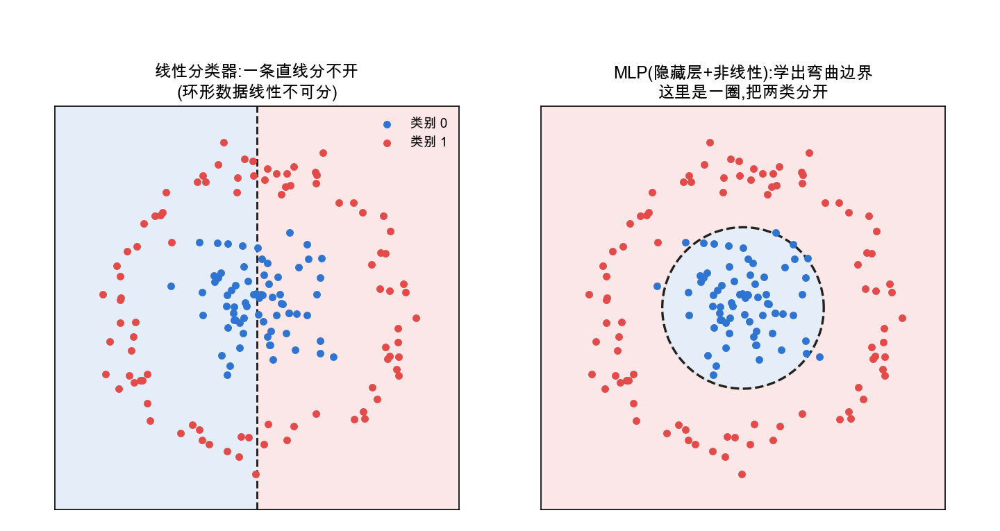
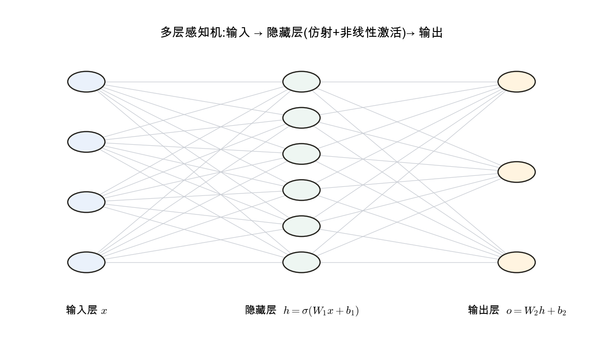
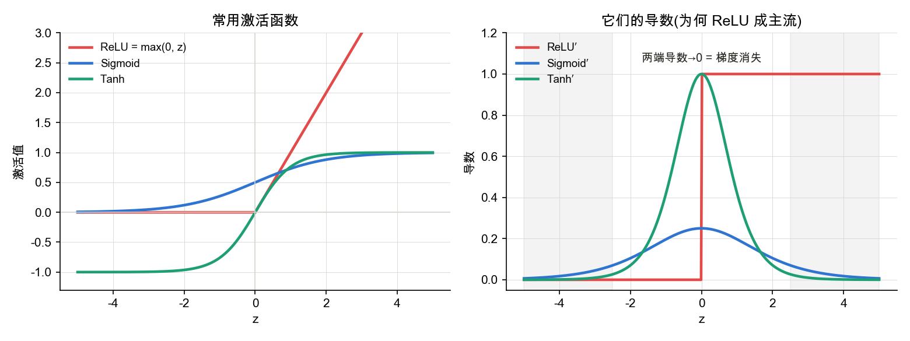
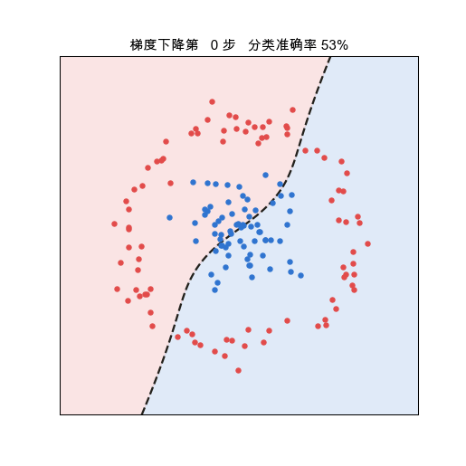

<!--# mlp -->
# 感知机 → 多层感知机(MLP)

> 上一章的逻辑回归 / softmax 都是**线性分类器**,决策边界只能是直线 / 超平面——遇到环形、异或这类**线性不可分**的数据就无法分开。多层感知机的突破在于:在线性层之间插入**非线性激活**并堆叠多层,从而表达更复杂的边界。它是所有现代神经网络的基石。记号锚定 d2l 4.1。

## 1. 为什么需要隐藏层与非线性

📌 **前置承接**:[逻辑回归 / softmax 回归](node:softmax) · [线性分类的几何视角](node:geometry)

单层线性模型(感知机 / 逻辑回归)的决策边界是直的,**线性不可分**问题(经典反例:异或 XOR)它根本学不会。一个自然的想法是堆叠多个线性层,但——**纯线性层叠加仍是线性**:$W_2(W_1\mathbf x)=(W_2W_1)\mathbf x$,等价于单个线性层(已在 [线性代数 · 矩阵乘法](node:linalg#矩阵乘法) 节强调)。

所以**必须在层之间插入非线性激活函数** $\sigma$,多层才有意义:
$$\mathbf h=\sigma(W_1\mathbf x+\mathbf b_1),\qquad \mathbf o=W_2\mathbf h+\mathbf b_2$$
有了非线性,网络才能改变表示空间、形成弯曲的决策边界。

> 线性分类器为何等价于"超平面 / 投影到分数轴",见子篇 [线性分类的几何视角](node:geometry);这条"线性套线性仍是线性、必须靠非线性换空间"的逐步演示,见子篇 [MLP 引入非线性的作用](node:nonlinear)。

## 2. 多层感知机的结构

📌 **结构承接**:[线性回归 = 单神经元](node:linreg) · [线性分类的几何视角](node:geometry)

MLP = 输入层 + 一个或多个**隐藏层** + 输出层,层与层**全连接**。每个隐藏单元先做仿射变换(加权和 + 偏置)再过激活函数;它正是 [线性回归 = 单神经元](node:linreg) 那张图的大规模堆叠。

层数(深度)与每层宽度是关键超参数;隐藏层让网络逐层把数据变换到更易分离的表示。

## 3. 激活函数

📌 **前置承接**:激活函数是从 [线性分类的几何视角](node:geometry) 走向非线性表示的关键环节,其梯度影响后续 [反向传播](node:backprop)。

隐藏层在仿射变换后套一个非线性 $\sigma$。三种常用激活横向对比:

| | ReLU | Sigmoid | Tanh |
|---|---|---|---|
| 公式 | $\max(0,z)$ | $\dfrac{1}{1+e^{-z}}$ | $\dfrac{e^{z}-e^{-z}}{e^{z}+e^{-z}}$ |
| 输出范围 | $[0,\infty)$ | $(0,1)$,**非零中心** | $(-1,1)$,**零中心** |
| 导数 | 正区恒 $1$、负区 $0$ | 最大仅 $0.25$,两端 $\to 0$ | 最大 $1$,两端 $\to 0$ |
| 算得快 | 一个 $\max$,极快 | 要算 $e^{z}$ | 要算 $e^{z}$ |
| 主要毛病 | 死亡 ReLU(负区永不更新) | **梯度消失最重 + 非零中心** | 梯度消失(两端饱和) |
| 放哪儿 | **隐藏层默认** | **输出层**(二分类概率) | 隐藏层(优于 sigmoid) |

**为什么隐藏层默认 ReLU**:反向传播把各层导数连乘回去。sigmoid 导数最大才 $0.25$、tanh 最大 $1$,两端还都趋 0——网络一深,这些 $<1$ 的数连乘使梯度**指数级衰减(梯度消失)**,深层学不动;ReLU 在激活路径上导数恒为 $1$,连乘不衰减,梯度能一路传到底(2012 年 AlexNet 之后深网络能堆深的关键之一)。

**sigmoid 尤其不适合隐藏层**:① 导数最大仅 $0.25$,梯度消失比 tanh 更重;② 输出**非零中心**(恒正),使同一神经元各权重的梯度同号、更新走 Z 字形、收敛慢。它更适合放在**输出层**输出概率;若隐藏层要用饱和型激活,tanh 也优于 sigmoid。

## 4. 通用近似定理

📌 **概念定位**:本节解释 MLP 的表达力上限;几何直觉与具体例子见 [MLP 引入非线性的作用](node:nonlinear)。

理论保证:**含单个隐藏层、足够多神经元的 MLP,可以以任意精度逼近任意连续函数**。这解释了 MLP 表达力的来源。但"存在"不等于"好训练":实践中**更深**(而非一味更宽)的网络往往更高效、更易学到层次化表示——这把我们引向"深度"学习。

## 5. 怎么训练:仍是损失 + 梯度下降

MLP 的训练与前面完全一致:定义损失(回归用 MSE、分类用交叉熵)→ 用梯度下降更新所有 $W,\mathbf b$。唯一的新问题是多层复合函数的梯度如何高效计算——这由 [反向传播](node:backprop) 解决(下一节)。

## 6. 网络如何学出这条弯曲边界

一个常见困惑是:从整体数据分布看,环形边界似乎显而易见;但训练中的模型并没有"圆"这个显式概念,它只接收三样东西:数据、标签和一个损失值。弯曲的边界是**最小化损失的结果**,不是预先写入的目标。分两层理解:

**① 隐藏层不是直接画出弯曲边界,而是在做非线性表示变换。** 输出层自始至终只是个**线性分类器**(一条直线 / 超平面)。隐藏层 $\sigma(W_1\mathbf x+\mathbf b_1)$ 先把输入空间**非线性地变换**(承接 [线性代数](node:linalg#矩阵):每层 $W\mathbf x$ 都是一次空间变换),使原本绕成一圈、线性分不开的数据,在新表示空间里变得线性可分;输出层在新空间里划一条直线,这条直线**映射回原始坐标**看起来就是弯的(这里是一圈)。所以"弯"不是直接画出来的,而是"先变换表示、再线性切分"的结果。

**② 参数靠梯度下降一步步试出来,没有蓝图。** 训练就是第 5 节那个循环:
- 随机初始化 → 边界通常是不规则曲线,准确率约 50%(接近随机猜测);
- 反向传播算出"每个权重往哪个方向微调能让损失下降一点点"(梯度);
- 沿梯度方向更新一小步,边界随参数发生微小变化,错分的点减少一些;
- 重复成百上千次。每一步都只是局部改进,并不显式规划"要成圆";但当损失被逐步降低,边界自然会贴合数据的环形结构。

这与**线性回归 SGD 动画**是同一个机制,只是函数更灵活、参数更多:线性回归中是直线逐步贴合样本点,这里是非线性边界逐步贴合环形结构。

**至于为何最终接近圆形、而不是其他形状**:环形数据让"圆"成为损失较低的解;同时网络容量有限、梯度下降倾向**平滑**的解。若隐藏单元过多(容量过大),模型也可能学出锯齿状、把每个噪声点都单独圈进去的边界——那就是 [机器学习概述](node:mlwhat#过拟合) 里说的**过拟合**(记住噪声而非规律)。

> 一句话直觉:训练不是直接指定目标边界,而是沿梯度逐步降低损失。边界形状是在参数更新过程中逐渐形成的,不是出发时预设的几何图形。

## 应掌握的要点
- 线性分类器边界是直的;线性层叠加仍线性,**必须有非线性激活**多层才有意义;
- MLP = 输入 + 隐藏层(仿射+激活)+ 输出,全连接;是单神经元的堆叠;
- ReLU 因不饱和、缓解梯度消失成为默认激活;sigmoid / tanh 两端饱和;
- 通用近似定理:单隐藏层 MLP 可逼近任意连续函数;但实践偏好更深;
- 训练仍是"损失 + 梯度下降",梯度由反向传播计算;
- **弯曲边界是怎么来的**:隐藏层做非线性表示变换,使数据线性可分;梯度下降再逐步逼近低损失解。边界形状是最小化损失的结果,不是模型显式预设的几何对象。完整几何承接见 [线性分类的几何视角](node:geometry)。

---
### 参考链接
- [d2l 4.1 多层感知机](https://zh.d2l.ai/chapter_multilayer-perceptrons/mlp.html) · [4.2 从零实现](https://zh.d2l.ai/chapter_multilayer-perceptrons/mlp-scratch.html)
- [多层感知机](https://zh.wikipedia.org/wiki/多层感知器) · [激活函数](https://zh.wikipedia.org/wiki/激活函数) · [通用近似定理](https://zh.wikipedia.org/wiki/通用近似定理)(维基百科)
