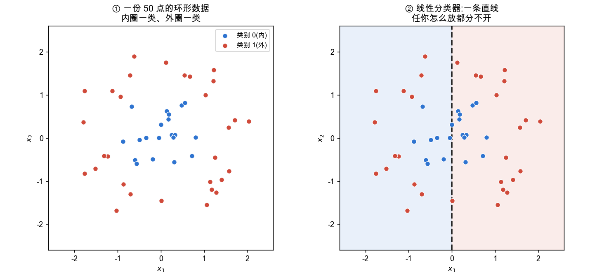
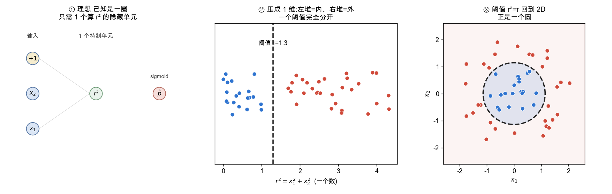
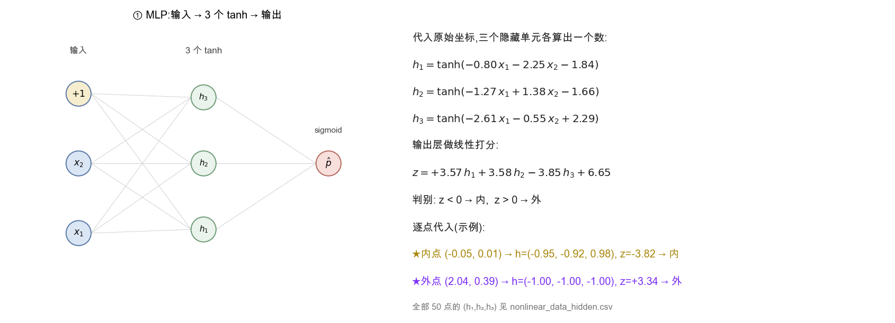
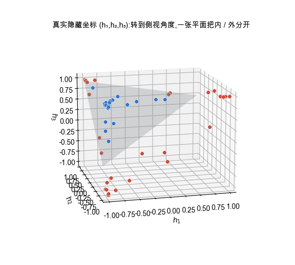
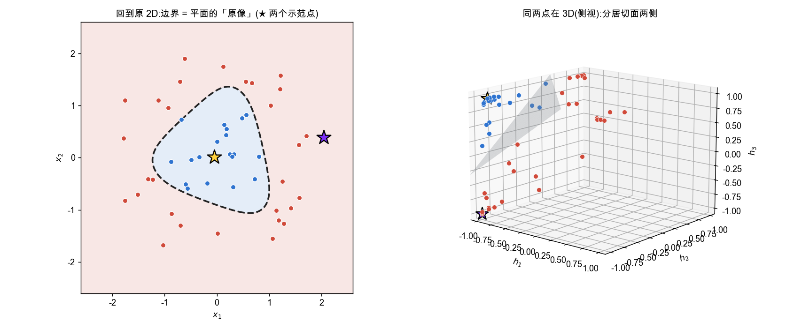
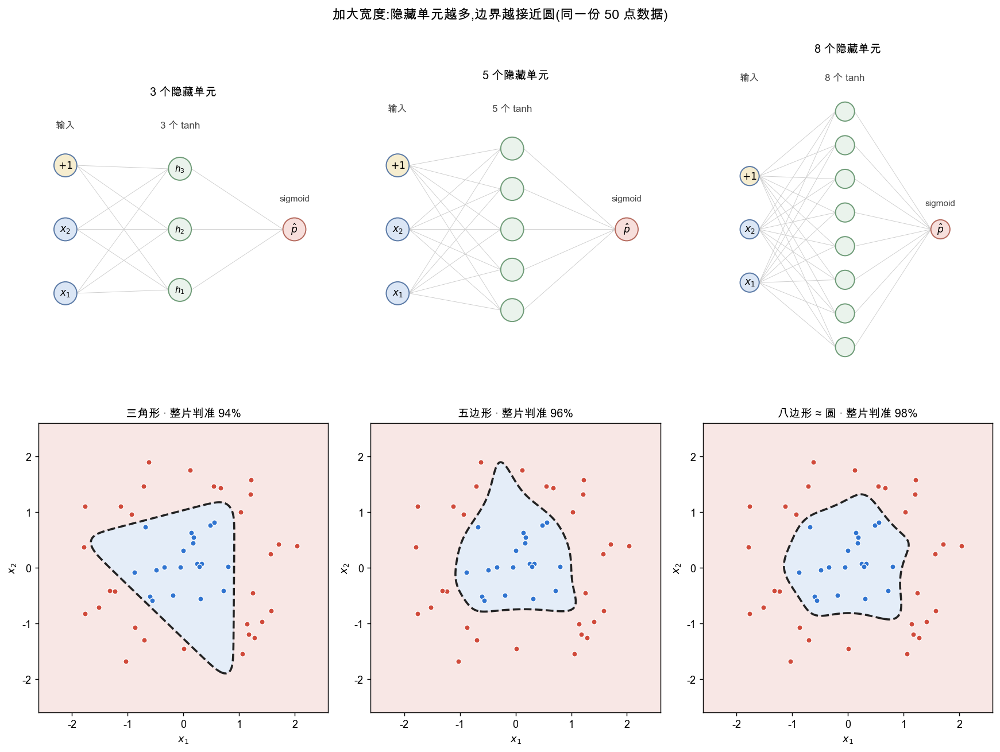

<!--# nonlinear -->
# MLP 引入非线性的作用

> 父篇介绍了 MLP 的结构与激活函数。本篇回答一个核心问题:线性模型(感知机 / 逻辑回归)的边界只能是直线,遇到线性不可分的数据(例如一类被另一类环绕)便无法分开,**而 MLP 为什么能表达弯曲的边界**。主线只有一句:**最终用于分类的"那一刀"始终是线性的,改变的只是"在哪个空间里切"——把数据搬进那个空间,正是隐藏层非线性的职责。** 下面用一份 50 点的环形数据逐步说明;**本文全部图与数据均可复现**,可运行代码与数据见 [实验 · MLP非线性可视化](node:lab)(坐标也在文末附录)。

## 1. 线性模型的局限

📖 **权威详解**:[线性可分性 · Wikipedia](https://zh.wikipedia.org/wiki/線性可分)

逻辑回归常被称作"线性模型",但它套了一层 sigmoid,容易让人误解"线性"指什么。把模型拆开看:打分 $z=\mathbf w\cdot\mathbf x+b$ 是**唯一**含可学参数的一步,也正是"线性"所指;sigmoid 只是把分数单调压进 $(0,1)$,不改变大小次序;交叉熵只衡量误差。决策边界是 $\hat p=0.5$,即 $z=0$,即 $\mathbf w\cdot\mathbf x+b=0$——一个线性方程。**所以无论 sigmoid 多弯,边界恒为直线 / 超平面。** 感知机同理。

面对"内圈一类、外圈一类"的环形数据,任何直线都必然大量错分:

这是模型形式的天花板,而非参数没调好。出路不是寻找更强的直线,而是**换一个能用直线切开的空间**。

## 2. 理想情形:已知分布时,一个隐藏单元即可

若**已知**数据是一圈,只需一个人工设计的特征——到原点的距离平方:
$$r^2=x_1^2+x_2^2$$
内圈点 $r^2$ 小、外圈点 $r^2$ 大。把每个点映射到这一个数上,两类即在一维数轴上被一个阈值 $\tau$ 完全分开;阈值 $r^2=\tau$ 映射回原坐标,正是一个圆。这相当于一个仅含**一个隐藏单元**的网络,只是该单元并非通用激活,而是直接计算 $r^2$ 的**特制单元**:

两点值得强调:

- 这一步是**降维**(2 维 → 1 维),而非升维。可见目标始终是"得到一个线性可分的表示",维度高低并非目的。
- 弯曲的圆边界,是"在 $r^2$ 空间里做一次线性切分、再映射回原坐标"的结果。

这正是深度学习之前的特征工程 / 核方法范式,其前提是**必须预先知道该构造什么特征**。环形可手写 $r^2$,但绝大多数任务(如图像识别)的有效特征无法人工指定。

## 3. 一般情形:用通用激活 tanh,升到真实的三维

不知道该构造什么特征时,改用**统一的通用单元**:每个隐藏单元都做"线性打分 + 同一个非线性 $\sigma$",即 $h_i=\sigma(\mathbf w_i\cdot\mathbf x+b_i)$,由训练自行决定构造什么。[激活函数](node:mlp#激活函数)通常在 tanh 与 ReLU 之间选取(两者都可一试、按结果取舍);本例用 **tanh**——它光滑,得到的边界是光滑曲线,而 ReLU 是分片线性、边界带硬棱角,对圆形目标不如 tanh 自然。

放 **3 个 tanh 单元**,把"升维"这一步拆成三小步看清楚(全部基于真实训练出的网络,数据为文末 50 点)。

### 3.1 算出每个点的新坐标

训练好后,三个隐藏单元就是三个**确定的函数**;代入原始坐标,每个点 $(x_1,x_2)$ 被算成三个数 $(h_1,h_2,h_3)$,输出层再对它们做一次线性打分 $z$:

这一步是纯计算:把一个点的 $x_1,x_2$ 代进三个 $\tanh$ 得到它的三维新坐标,再代进 $z$ 看正负。上图右下角验算了两个点——中心的内点 $z<0$ 判内、最外的外点 $z>0$ 判外。全部 50 点的新坐标见 `nonlinear_data_hidden.csv`。

### 3.2 在真实的三维里,一张平面就能切开

把 50 个点画到它们**真实的** $(h_1,h_2,h_3)$ 坐标上——注意这是和原始 $(x_1,x_2)$ **完全不同的空间**。原本绕成一圈、在 2D 里直线切不开的数据,到这里被输出层那张平面清晰地分成两半:

这就是"升维"的实质:**换一个空间,让原本线性不可分的数据变得线性可分**;输出层 $z=0$ 就是那张分隔平面。把动图转到平面的**侧面(edge-on)**,它会缩成一条线——此时蓝点全在一侧、红点全在另一侧,"一张平面分开两类"看得最清楚。(tanh 会把已分开的点压向 $\pm1$,故点会向立方体边缘聚集;这是强非线性压缩的现象,不影响可分。)

### 3.3 把平面映射回原 2D,就是那条弯曲边界

回到原始平面:对每个点,代入 $h=\tanh(W\mathbf x+\mathbf b)$ 看它在三维里落到切面哪一侧——"翻面"的那条线,就是原 $(x_1,x_2)$ 平面上的决策边界:

**这一步可以写成一条方程。** 三维里的切面是 $w^{\mathrm o}_1h_1+w^{\mathrm o}_2h_2+w^{\mathrm o}_3h_3+b^{\mathrm o}=0$;把每个 $h_i=\tanh(\mathbf w_i\cdot\mathbf x+b_i)$ 代进去,就得到一个**只含 $x_1,x_2$ 的方程**,它的解集就是原平面上那条曲线。所以 2D 边界正是这张平面在非线性映射 $\mathbf x\mapsto\mathbf h$ 下的**原像**:平面在 $\mathbf h$ 空间是直的,但 $\mathbf x\mapsto\mathbf h$ 这一步是弯的(tanh),把同一张平面拉回 $\mathbf x$ 空间就成了闭合曲线。实际作图就是:把整片输入平面网格逐点算出 $\mathbf h$、代入上式看符号,**符号翻转处**连起来即这条边界(上图左)。

左右用同两个点(★)对照:**同一个点,在原 2D 有位置、在 3D 有它算出来的新坐标;它在三维里落在切面哪侧,就决定类别。这条 2D 边界,正是三维那张平面在原平面上的「原像」。** 3 个单元只够把边界围成圆角三角形(此实例约 98%;不同初始化会有出入,下一节比较"宽度"时用各宽度的典型表现)。

## 4. 加大宽度:逼近精度随隐藏单元数提升

增加隐藏单元(升到更高维),边界便有更多"边"去逼近圆:

3 个单元形成近似三角形边界(94%)、5 个单元形成近似五边形边界(96%)、8 个单元进一步接近圆形边界(98%)。每个隐藏单元贡献一条"软边",边越多,围合的边界越接近真实的圆。[通用近似定理](node:mlp#通用近似)给出理论保证:单隐藏层、足够多的单元即可逼近任意边界——这正是"通用单元 + 足够宽度 + 训练"得以替代"人工设计的完美特征"的依据。

(此处"整片区域判准"指在同分布上另采的密集点集上的正确率,用以衡量边界形状好坏,而非记住这 50 个训练点;详见附录。)

## 5. 统一视角:隐藏层换空间,输出层线性切分

贯穿全篇的主线有三条:

- **最终的切分始终是线性的。** 逻辑回归在原始 2 维切一条直线;特制 $r^2$ 在 1 维卡一个阈值;MLP 在隐藏层升出的高维空间切一张超平面。三者最后那一刀都是线性的,区别仅在"于哪个空间切分"。MLP 输出层的 sigmoid 单元,扮演的正是这张超平面。
- **非线性的职责,是把数据搬进那个空间**,即隐藏层激活。没有它,"线性套线性仍是线性"($W_2(W_1\mathbf x)=(W_2W_1)\mathbf x$,见 [线性代数 · 矩阵乘法](node:linalg#矩阵乘法)),堆叠再多层仍等价于一条直线。
- **维度高低不是目的,线性可分才是。** 有完美先验可降维(一个 $r^2$);无先验则用通用单元升维(3→8)逼近。升的是**嵌入空间维度**(2→8),数据的**内在维度恒为 2**(8 个特征皆由 2 个输入算出,仅分布在 8 维空间中的一张 2 维曲面上)。

掌握这条主线后,再看 [多层感知机](node:mlp) 的结构、[反向传播](node:backprop) 如何训练这些 $\mathbf w,b$,皆顺理成章。

## 延伸
- **特征工程 vs 神经网络**:前者人工设计特征(形式可各异,如 $x_1^2+x_2^2$、$x_1x_2$),依赖领域知识;后者用统一通用形式、由训练学得。两者都需人工设定超参(单元数、层数、激活种类——凭经验与验证集),但"每个单元最终表示什么"由训练决定。
- **人工构造特征 = 注入先验(归纳偏置)**:先验正确则高效,错误则有害。现代做法在**架构**层面注入先验——[CNN](node:cnn) 的卷积对应平移不变性、[注意力](node:attn) 对应成对关系——而非手写单个神经元的形式。
- **历史脉络**:人工特征(SIFT / HOG + SVM 核)→ 端到端自动学习特征(深度学习,2012 年 AlexNet 为分水岭)。本篇"手工 $r^2$ → 通用 tanh"即这一演进的缩影。

## 应掌握的要点
- 逻辑回归 / 感知机的"线性"指**打分 $\mathbf w\cdot\mathbf x+b$**;sigmoid 与损失都不改变"边界是直线";
- 线性边界无法分开环形等线性不可分数据,出路是**换空间**;
- 有完美先验可手工造特征并**降维**($r^2\to$ 1D);无先验则用通用激活 tanh **升维**,单元越多边界越接近圆;
- 全程是"线性切分,只换空间";非线性全在隐藏层激活,**线性套线性仍是线性**;
- 升的是嵌入维度,数据内在维度不变;**维度高低非目的,线性可分才是**。

## 附录:数据与实验设定(可复现)
- 本文全部图、50 点数据、每点的 $(h_1,h_2,h_3)$ 新坐标,以及生成它们的完整代码,都在 [实验 · MLP非线性可视化](node:lab)(`nonlinear_data.csv` / `nonlinear_data_hidden.csv` / `nonlinear_demo.py` / `.ipynb`)。
- 数据生成规则:内圈半径 $r\in[0.05,\,1.0]$、外圈 $r\in[1.25,\,2.1]$,角度均匀(共 50 点,内 20 / 外 30);故 $r^2$ 严格可分(内 $\le1.0$ < 外 $\ge1.56$),阈值取 $\tau=1.3$。
- 升维实验在同一份数据上训练 $2\to k\ \text{tanh}\to 1$ 的小网络($k=3,5,8$);"整片区域判准"为同分布另采密集点集上的正确率,衡量边界形状而非死记训练点。

---
### 参考链接
- [d2l 4.1 多层感知机](https://zh.d2l.ai/chapter_multilayer-perceptrons/mlp.html)(线性不可分与非线性的动机)
- [通用近似定理 · Wikipedia](https://zh.wikipedia.org/wiki/通用近似定理) · [核方法 · Wikipedia](https://zh.wikipedia.org/wiki/核方法)
