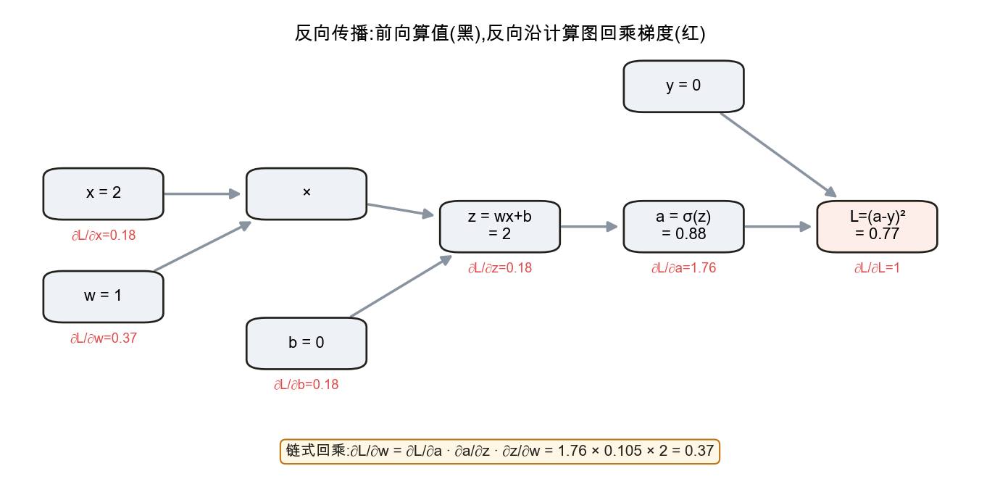
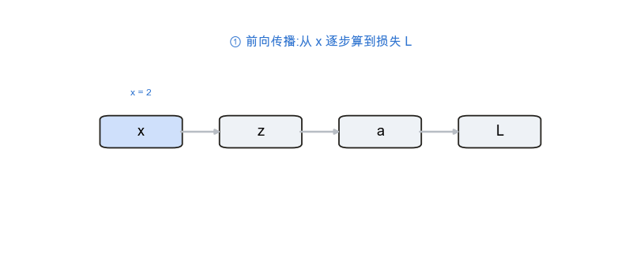

<!--# backprop -->
# 反向传播与计算图

> 多层网络是层层复合的函数,要训练它就得求"损失对每个参数的梯度"。**反向传播**给出了高效算法:它本质是「微积分」节链式法则的**系统化、向量化**应用,沿计算图从损失端**逐段回乘**局部梯度。框架(PyTorch 等)的自动微分就是它。记号锚定 d2l 4.7。

## 1. 计算图:把复合函数画成图

📖 **权威详解**:[反向传播算法 · Wikipedia](https://zh.wikipedia.org/wiki/反向传播算法)

把一个复合表达式拆成基本运算,画成有向图:**节点是运算 / 变量,边是数据流向**。例如一个神经元的损失 $L=(\sigma(wx+b)-y)^2$ 可拆为:乘 → 加 → sigmoid → 平方误差。计算图让"先算什么、梯度怎么传"一目了然。

## 2. 前向传播:沿图算出损失

按图的方向(输入 → 输出)依次计算每个节点的值,直到得到损失 $L$。这一步顺便**缓存各中间结果**(如 $z,a$),供反向阶段复用。

## 3. 反向传播:从损失端回乘梯度

📖 **权威详解**:[链式法则 · Wikipedia](https://zh.wikipedia.org/wiki/链式法则);严谨定义跳转本库 [数学基础 · 微积分 §3 链式法则](node:calc#链式法则)

反向传播 = **链式法则 + 复用**:从 $L$ 出发($\partial L/\partial L=1$),沿图**逆向**逐节点计算"损失对该节点的梯度",每一步只需把下游传来的梯度乘以**本地导数**。因为复用了下游已算好的梯度,整张图只需**一次**反向遍历,代价与前向同阶——这正是它高效的原因(对比逐参数数值差商要前向无数次)。

上图是 $L=(\sigma(wx+b)-y)^2$ 在 $x=2,w=1,b=0,y=0$ 处的完整一遍:黑色是前向值,红色是反向梯度。注意 $\partial L/\partial w$ 就是把链上三段本地导数乘起来。

## 4. 与自动微分 / 框架的关系

📖 **权威详解**:[自动微分 · Wikipedia](https://zh.wikipedia.org/wiki/自动微分)

深度学习框架会在前向代码执行时**自动构建计算图**,调用 `loss.backward()` 即按上述规则反向求出所有参数梯度(这种模式称"反向模式自动微分")。所以实践中通常不手写梯度——但理解反向传播,才能看懂梯度消失 / 爆炸、调试 NaN、设计新层。它与本库 [矩阵求导 · 链式法则的矩阵形式](node:matcalc#矩阵形式) 的**雅可比连乘**,是同一件事的标量版与向量版。

## 应掌握的要点
- 计算图:节点 = 运算、边 = 数据;前向算值并缓存中间结果;
- 反向传播 = 链式法则 + 复用下游梯度,**一次**反向遍历求出全部梯度,代价与前向同阶;
- 能在小例子上手算前向值与反向梯度(本地导数逐段相乘);
- 框架用反向模式自动微分实现它;本质 = 微积分链式法则 / 矩阵求导雅可比连乘的工程化。

---
### 参考链接
- [d2l 4.7 前向传播、反向传播和计算图](https://zh.d2l.ai/chapter_multilayer-perceptrons/backprop.html) · [2.5 自动微分](https://zh.d2l.ai/chapter_preliminaries/autograd.html)
- [反向传播算法](https://zh.wikipedia.org/wiki/反向传播算法) · [自动微分](https://zh.wikipedia.org/wiki/自动微分)(维基百科)
- [3Blue1Brown · 神经网络与反向传播](https://www.3blue1brown.com/topics/neural-networks)
- 本库内链:[微积分 · 链式法则](node:calc#链式法则) · [矩阵求导 · 雅可比连乘](node:matcalc#矩阵形式)
