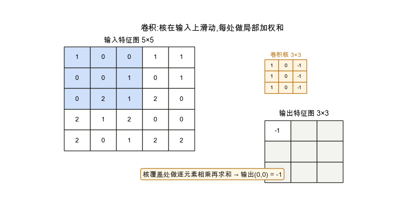
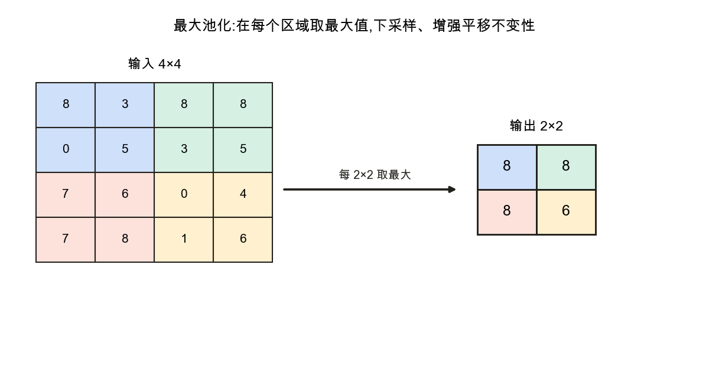

<!--# cnn -->
# 卷积神经网络 CNN

> 处理图像若用全连接 [MLP](node:mlp),参数会爆炸(百万像素 × 隐藏单元),且没利用图像的**空间结构**。CNN 用**卷积**替代全连接:局部连接 + 参数共享,大幅减少参数,并自带**平移不变性**——是计算机视觉的基石。记号锚定 d2l 第 6 章。

## 1. 为什么不用全连接处理图像

一张 $1000\times1000$ 的图展平就是百万维输入,接一个千单元的全连接层就有十亿参数——既算不动也极易过拟合。而且全连接**打乱了像素的空间关系**,没利用"相邻像素相关、同一特征可出现在任意位置"这些先验。

## 2. 卷积运算:局部加权和 + 参数共享

📌 **前置承接**:[多层感知机](node:mlp) 的全连接层没有利用图像空间结构;CNN 用局部连接与参数共享把这种结构先验写进模型。

用一个小的**卷积核(filter)**在输入上滑动,每到一处就和覆盖的局部区域做**逐元素相乘再求和**,得到输出**特征图**的一个值(深度学习里实际用的是"互相关")。

两个关键性质:**局部连接**(每个输出只看一小块,不是全部像素)与**参数共享**(同一个核扫遍全图)。这让参数量从"与图像大小成正比"降到"只有一个小核",并带来**平移不变性**——同一特征(如边缘)出现在哪里都能被同一个核检测到。

## 3. 关键概念:核 / 步幅 / 填充 / 通道

- **卷积核大小**:如 $3\times3$,决定感受野;
- **步幅(stride)**:核每次滑动的格数,步幅大则输出更小;
- **填充(padding)**:在边缘补零,控制输出尺寸、保住边界信息;
- **通道(channel)**:彩色图有 RGB 三通道,每个卷积核跨所有输入通道;一层用多个核 → 多张特征图(多个输出通道),分别检测不同特征。

## 4. 池化:下采样

在每个小区域取最大(**最大池化**)或平均,降低特征图分辨率:减少计算、扩大后续层的感受野,并增强对微小平移的鲁棒性。

## 5. 典型结构

一个经典 CNN = 若干 **[卷积 + 激活 + 池化]** 块堆叠(逐层提取由低到高的特征:边缘 → 纹理 → 部件 → 物体)→ 末端接全连接层做分类。代表网络:**LeNet**(手写数字)、**AlexNet**(点燃深度学习热潮)、**VGG / ResNet**(更深,ResNet 用残差连接训练上百层)。

## 应掌握的要点
- 全连接处理图像:参数爆炸 + 不利用空间结构;
- 卷积 = 局部加权和 + **参数共享**,带来平移不变、参数大减;
- 核 / 步幅 / 填充 / 通道的作用;多核 → 多特征图;
- 池化 = 下采样,减计算、增平移鲁棒;
- 经典结构 = [卷积+激活+池化] 堆叠 + 全连接;逐层特征由低到高。

---
### 参考链接
- [d2l 第 6 章 卷积神经网络](https://zh.d2l.ai/chapter_convolutional-neural-networks/index.html) · [第 7 章 现代卷积网络](https://zh.d2l.ai/chapter_convolutional-modern/index.html)
- [卷积神经网络](https://zh.wikipedia.org/wiki/卷积神经网络) · [卷积](https://zh.wikipedia.org/wiki/卷积)(维基百科)
