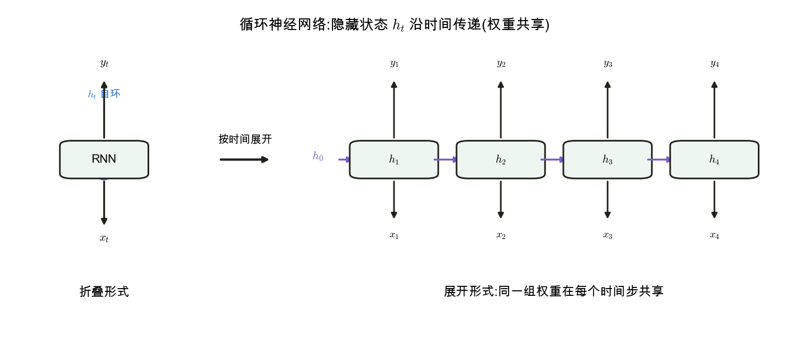
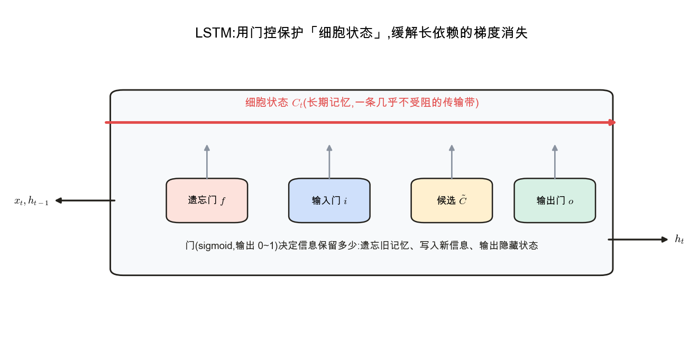

<!--# rnn -->
# 循环神经网络 RNN

> [CNN](node:cnn) 擅长图像的空间结构,但**序列数据**(语言、语音、时间序列)需要"记忆":当前输出依赖于前面看过的内容。RNN 引入一个随时间传递的**隐藏状态**来承载记忆,并在每个时间步**共享同一组权重**。记号锚定 d2l 第 8–9 章。

## 1. 序列数据与"记忆"的需求

一句话里"它"指代谁、一段股价的趋势,都要求模型记住前文。固定输入的 MLP / CNN 做不到;RNN 的思路:**把上一步的隐藏状态也作为这一步的输入**,于是信息能沿序列流动。

## 2. RNN 的结构:隐藏状态 + 权重共享

📖 **权威详解**:[循环神经网络 · Wikipedia](https://zh.wikipedia.org/wiki/循环神经网络)

每个时间步 $t$,用当前输入 $\mathbf x_t$ 和上一步隐藏状态 $\mathbf h_{t-1}$ 算出新的隐藏状态,再(可选)产生输出:
$$\mathbf h_t=\sigma(W\mathbf h_{t-1}+U\mathbf x_t+\mathbf b),\qquad \mathbf y_t=V\mathbf h_t$$
关键:$W,U,V$ 在**所有时间步共享**,参数量与序列长度无关。

## 3. 时间上展开与 BPTT

把 RNN 沿时间"展开"成一条长链,就能像普通多层网络一样做 [反向传播](node:backprop)——称**沿时间反向传播(BPTT)**:梯度从最后时间步沿隐藏状态链一路回传到最早。

## 4. 梯度消失 / 爆炸:长依赖之难

📌 **前置承接**:[反向传播与计算图](node:backprop) · [MLP · 激活函数](node:mlp#激活函数)

回传时梯度要连乘很多个相近量级的因子:略小于 1 → 指数**衰减(消失)**,略大于 1 → 指数**膨胀(爆炸)**。后果是普通 RNN 很难学到**长距离依赖**(早期信息传不到后面)。爆炸可用梯度裁剪缓解,消失则需结构改进。

## 5. LSTM / GRU:门控缓解长依赖

📖 **权威详解**:[长短期记忆 · Wikipedia](https://zh.wikipedia.org/wiki/長短期記憶)

**LSTM** 引入一条几乎不受阻的**细胞状态**(长期记忆传输带),并用**门**(sigmoid,输出 0~1)控制信息流:遗忘门决定丢弃多少旧记忆、输入门决定写入多少新信息、输出门决定输出多少。这让梯度能沿细胞状态稳定回传,显著缓解梯度消失。**GRU** 是其简化版(更少的门)。

## 应掌握的要点
- 序列需要记忆;RNN 用隐藏状态 $\mathbf h_t$ 沿时间传递,**权重跨时间共享**;
- 训练 = 时间展开后做反向传播(BPTT);
- 梯度连乘导致**消失 / 爆炸**,长依赖难学(爆炸→裁剪,消失→改结构);
- LSTM / GRU 用**门控 + 细胞状态**缓解长依赖,是 RNN 的主力变体。

---
### 参考链接
- [d2l 第 8 章 循环神经网络](https://zh.d2l.ai/chapter_recurrent-neural-networks/index.html) · [第 9 章 现代循环网络(LSTM/GRU)](https://zh.d2l.ai/chapter_recurrent-modern/index.html)
- [循环神经网络](https://zh.wikipedia.org/wiki/循环神经网络) · [长短期记忆 LSTM](https://zh.wikipedia.org/wiki/長短期記憶)(维基百科)
- [Colah · Understanding LSTM Networks](https://colah.github.io/posts/2015-08-Understanding-LSTMs/)
