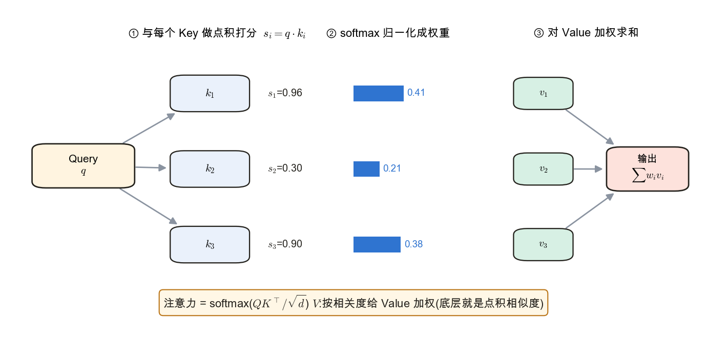
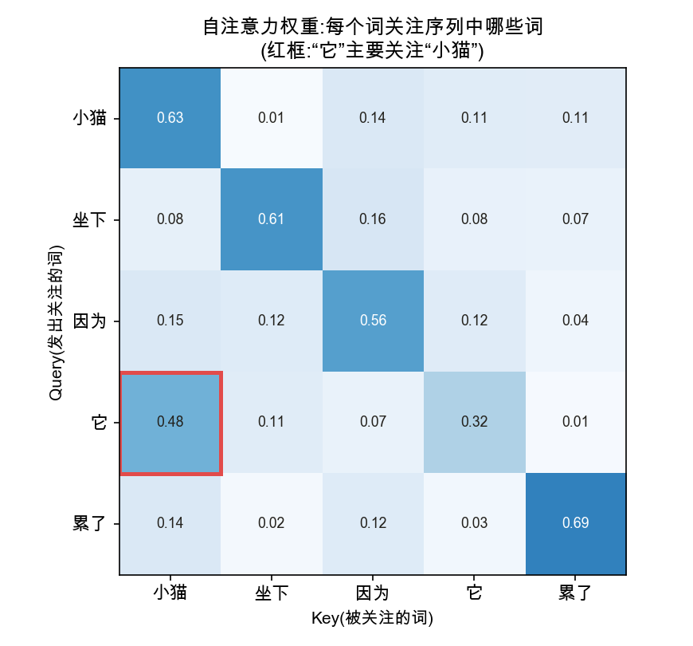
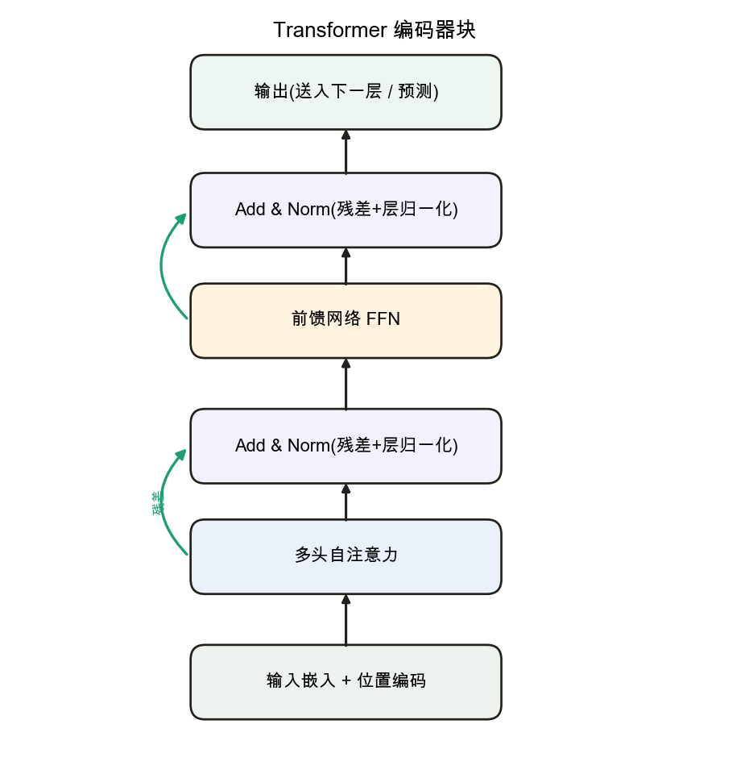

<!--# attn -->
# 注意力机制 → Transformer

> 这一节讲两件事:先是**注意力机制**——让序列里每个位置直接"看"到所有位置、按相关度聚合信息,解决 RNN 串行慢、长依赖弱的瓶颈;再是 **Transformer**——把注意力堆成一个完全基于注意力(无循环、无卷积)的架构,它是当今大模型的骨架,也是本库实验主线 mini-GPT 的终点。注意力的两个零件(点积、softmax)正是前面「线性代数」「概率」两节的直接复用。记号锚定 d2l 第 10–11 章。

## 一、注意力机制

### 1. 从 RNN 瓶颈到注意力

RNN 把整段历史压在一个隐藏状态里逐步传递:远处信息易丢失,且必须**串行**计算(第 $t$ 步要等第 $t-1$ 步)。注意力换一条路——让任意两个位置**一步直连**:每个位置直接对序列里所有位置算"相关度",再加权汇总。这既缓解长依赖,又能大规模并行,是它取代 [循环神经网络](node:rnn) 的根本原因。

### 2. Query / Key / Value:一次注意力怎么算

📌 **前置承接**:注意力直接复用 [线性代数 · 点积](node:linalg#点积) 做相似度打分,再用 [softmax](node:softmax) 归一化权重。

每个位置生成三组向量:**Query**(当前要匹配的查询)、**Key**(可被匹配的标识)、**Value**(实际汇总的信息)。计算分三步——用 Query 与各 Key 做**点积**得相关度分数,经 softmax 归一化成权重,再对 Value 加权求和:
$$\operatorname{Attention}(Q,K,V)=\operatorname{softmax}\!\Big(\frac{QK^\top}{\sqrt{d_k}}\Big)V.$$
除以 $\sqrt{d_k}$ 是防止点积过大把 softmax 推向饱和。两个零件都是旧识:打分核心 $QK^\top$ 就是 [线性代数 · 点积](node:linalg#点积) 的相似度,归一化用的 [softmax](node:softmax) 来自分类那一节——注意力是前面知识的直接组合。

### 3. 自注意力与多头

**自注意力(self-attention)**:Q、K、V 都来自同一序列,于是序列内部两两互相关注,一步捕捉任意距离的依赖。

**多头注意力**:并行做多组注意力(多个"头"),每头在不同子空间关注不同关系,再把结果拼接——类似 CNN 用多个卷积核提取不同特征。

### 4. 位置编码

注意力本身**无序**(打乱输入顺序,输出只是跟着换位、关系不变),但语言有语序。于是给每个位置叠加**位置编码**(正弦函数或可学习向量),把"第几个"注入表示。

## 二、Transformer 架构 → mini-GPT

### 1. Transformer 块

📌 **结构承接**:Transformer 把自注意力堆叠成主干结构,接在 [RNN](node:rnn) 的序列建模问题之后,也是实验主线 mini-GPT 的前置概念。

Transformer 由若干相同的**块**堆叠,每块 = **多头自注意力 → Add & Norm → 前馈网络 FFN → Add & Norm**;其中 Add 是**残差连接**(缓解深层训练,与 [卷积神经网络](node:cnn) 里 ResNet 同一思路),Norm 是层归一化。

编码器、解码器都由这种块堆成;GPT 这类生成模型用的是**带掩码的解码器**堆叠(每个位置只能看到左侧已生成的词)。

### 2. 通往 mini-GPT

至此,从数学基础一路到注意力,理解大模型所需的核心拼图已齐备。实验主线的终点正是从零搭一个 mini-GPT:词嵌入 + 位置编码 + 多层带掩码自注意力块 + 语言建模损失(预测下一个词,本质就是 [交叉熵](node:prob#交叉熵))。

## 应掌握的要点
- 注意力让任意位置一步直连,缓解 RNN 长依赖与串行瓶颈;
- $\operatorname{softmax}(QK^\top/\sqrt{d_k})V$:点积打分(相似度)→ softmax 权重 → 加权 Value;
- 自注意力 = 序列内部互相关注;多头 = 并行多组关注不同关系;
- 注意力无序,需位置编码;
- Transformer 块 = 多头自注意力 + FFN + 残差 + 层归一化;GPT = 带掩码解码器堆叠 → mini-GPT。

---
### 参考链接
- [d2l 第 10 章 注意力机制](https://zh.d2l.ai/chapter_attention-mechanisms/index.html) · [Transformer 一节](https://zh.d2l.ai/chapter_attention-mechanisms/transformer.html)
- [注意力机制](https://zh.wikipedia.org/wiki/注意力机制) · [Transformer 模型](https://zh.wikipedia.org/wiki/Transformer模型)(维基百科)
- [The Illustrated Transformer](https://jalammar.github.io/illustrated-transformer/) · [The Annotated Transformer](http://nlp.seas.harvard.edu/annotated-transformer/)
- 本库内链:[线性代数 · 点积](node:linalg#点积) · [概率 · 交叉熵](node:prob#交叉熵) · [循环神经网络](node:rnn)
