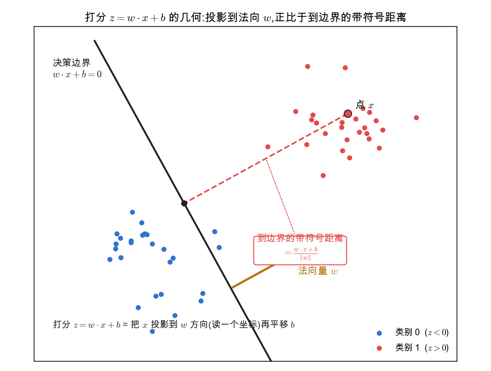
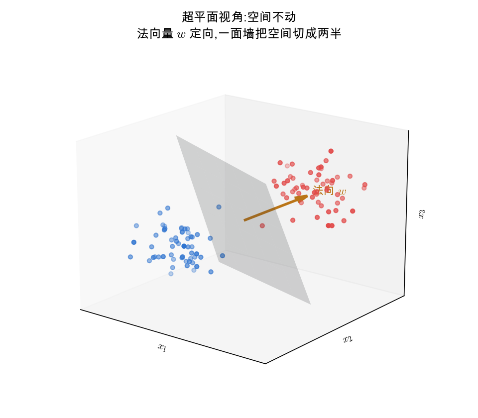
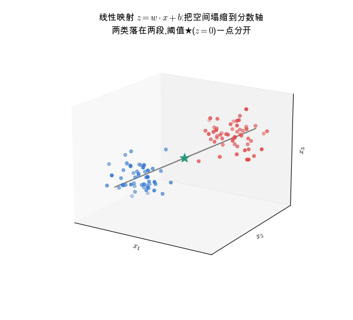

# 几何视角:线性分类的空间解释(超平面 = 投影到分数轴)

> 📌 **暂存草稿**:本文从「逻辑回归 / softmax」节抽出,先放这里暂存;待与「深度学习」章节(尤其多层感知机"为何必须非线性")一起整理后,再定最终归属。**暂不纳入知识地图**(不在 `知识库/` 内,`build.py` 不收录)。

线性分类器(逻辑回归 / softmax)的核心是一个线性打分 $z=\mathbf w\cdot\mathbf x+b$。从几何看,它藏着两种等价身份——"一面墙"和"一根分数轴"。理解这一点,能直观看出**为什么线性分类器只能画直边界、要画弯的必须上深度网络**。

**① 打分 $\mathbf w\cdot\mathbf x$ 就是"投影到 $\mathbf w$ 方向"。** 点积的几何式(见「线性代数·点积」)是 $\mathbf w\cdot\mathbf x=\lVert\mathbf w\rVert\,\lVert\mathbf x\rVert\cos\theta$,即 $\lVert\mathbf w\rVert$ 乘以「$\mathbf x$ 在 $\mathbf w$ 方向上的投影长」。所以打分 $z=\mathbf w\cdot\mathbf x+b$ 是把 $\mathbf x$ **投影到 $\mathbf w$ 这一个方向、读出一个坐标,再平移 $b$**——一个 $\mathbb R^n\to\mathbb R^1$ 的线性映射,把整个空间"压"到一条轴上;$\mathbf w$ 是边界的**法向量**,点到边界的**带符号距离**正是 $z/\lVert\mathbf w\rVert$。

**② 身份一:一面墙(空间不动)。** 边界 $\{\mathbf x:\mathbf w\cdot\mathbf x+b=0\}$ 是一个 $(n-1)$ 维**超平面**(2 维里是直线、3 维里是平面),把空间切成两个半空间:$z>0$ 判一类、$z<0$ 判另一类。**点没有移动**,你只是找到了那面墙、看点落在哪一侧。

**③ 身份二:一根分数轴(把空间塌缩到 1 维)。** 换个看法:让每个点沿 $\mathbf w$ **投影、塌缩到分数轴**上,落点就是它的分数 $z$。两类自然落在 $z<0$ 与 $z>0$ 两段,分界退化成轴上**一个阈值点**($z=0$)。

**两种身份是同一个 $(\mathbf w,b)$。** 那面 $(n-1)$ 维的墙,正是"投影后恰好落在阈值点上"的全部点的集合——**墙 = 阈值点的原像**。高维一面墙 ⇄ 一维轴上一个点,靠"投影 / 原像"互相对应(这正是「线性代数·对偶」:向量 $\mathbf w$ ⇄ "把向量投影成一个数"的线性函数)。

**④ 为什么"先做线性变换再分类"没用、必须上非线性。** 既然分类就是"投影 + 阈值",先对数据做线性变换 $A$ 再分会不会更强?展开看 $\mathbf w\cdot(A\mathbf x)+b=(A^\top\mathbf w)\cdot\mathbf x+b$,**还是一次"投影 + 阈值",墙还是直的**——线性地搬空间不给分类器任何新本事,**线性可分性在线性变换下不变**。要把缠成一圈、直线分不开的两类分开,只能靠**非线性**先把空间掰弯(隐藏层 $\sigma(W\mathbf x+\mathbf b)$):新空间里墙仍是直的一刀,映射回原空间就成了弯边界。这正是通往「多层感知机」的根本动因。

---
### 待整理
- 最终大概率并入「深度学习 · 多层感知机」或单列一个"几何直觉"节,作为"线性→为何要非线性"的承接。
- 关联:本库「数学基础 · 线性代数」(点积与对偶)、「机器学习基础 · 逻辑回归」(打分 $z=\mathbf w\cdot\mathbf x+b$)。
